# Developer Guide

## Acknowledgements

{list here sources of all reused/adapted ideas, code, documentation, and third-party libraries -- include links to the
original source as well}

## Design

EZMealPlan follows a modular and object-oriented design centered around a command-based architecture.

### Architecture Overview

EZMealPlan consists of the following main packages:

- `ezmealplan`: Initialises the app and starts the other components. Closes the other components upon exit of the app.
- `ui`: Captures user input and displays outputs via the command line.
- `parser`: Interprets user input and delegates to appropriate command classes.
- `command`: Represents different actions that can be executed. Commands have corresponding `checker`s that perform data
  validation and error handling.
- `logic`: Interacts with the `meallist`.
- `meallist`: Encapsulates meal storage and implements operations on them, such as adding, removing, and viewing meals.
- `food`: Represents meals and their subcomponents.
- `storage`: Initialises, saves, and loads data to and from the disk.

- Global logger is initialized in the `EZMealPlan` class.

- Functional classes use `logger.WARNING` for exceptions and `logger.SEVERE` for assertions.

- JUnit test classes use their own logger with `logger.INFO` for exceptions.

### `ezmealplan`

This package contains the main `EZMealPlan` class, which is the entrance point for the app.

It instantiates one `MealManager` and one `UserInterface`, which are shared across all other classes. It also
calls static methods in the `Command`, `Storage` and `Parser` classes. Below is a partial class diagram representing
the associations:
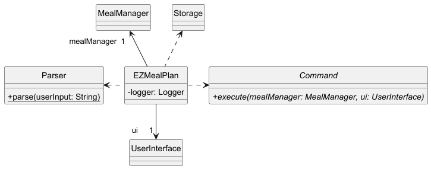

This sequence diagram shows the processes that EZMealPlan system has to undergo while it is being booted up before it
is ready for usage. **Take Note** Meals that are found in the wishlist but are not found in the recipes list will be
deemed as **illegal meals** and removed from the wishlist.

This fundamental rule should not be violated:

* **Meals found in the wishlist implies that the meals _MUST_ also be in the recipes list.**


This sequence diagram shows the procedures of extracting meals from the `recipesListFile` (`recipesList.txt`). A similar
procedure follows for extracting meals from the `wishListFile` (`wishList.txt`).
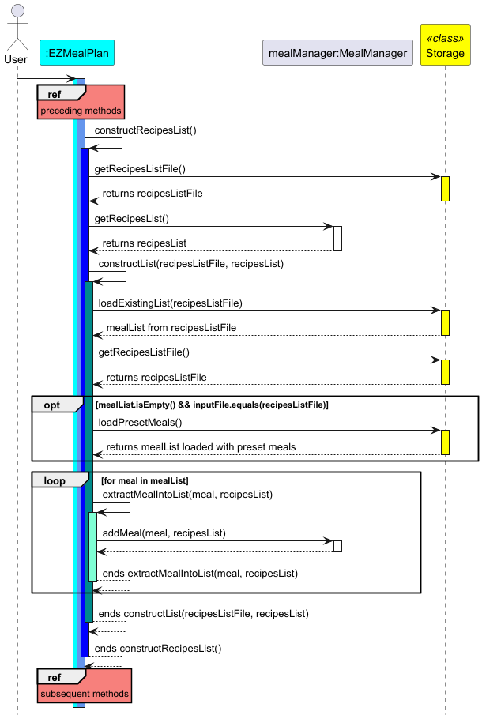

The inventory list will be loaded from the `inventoryListFile.txt` via `Storage.loadExistingInventory(mealManager)`
method.

### `ui`

User input is captured by `readInput` in the `UserInterface` object, which is returned to `EZMealPlan`. `EZMealPlan`
calls the static method `parse` in `Parser` to process the input, which then creates the appropriate `Command` object.

This sequence diagram shows the general flow of how the EZMealPlan system process the respective command inputted by
the user. Many relevant details and classes have been omitted for the purpose of simplicity. The implementations for
the respective commands will be explained in greater details and illustrated with UML diagrams later.


- All user inputs are case-sensitive and normalised to lowercase.

### `food`

The `food` package contains the abstract class `Product`, as well as `Ingredient` and `Meal` classes.

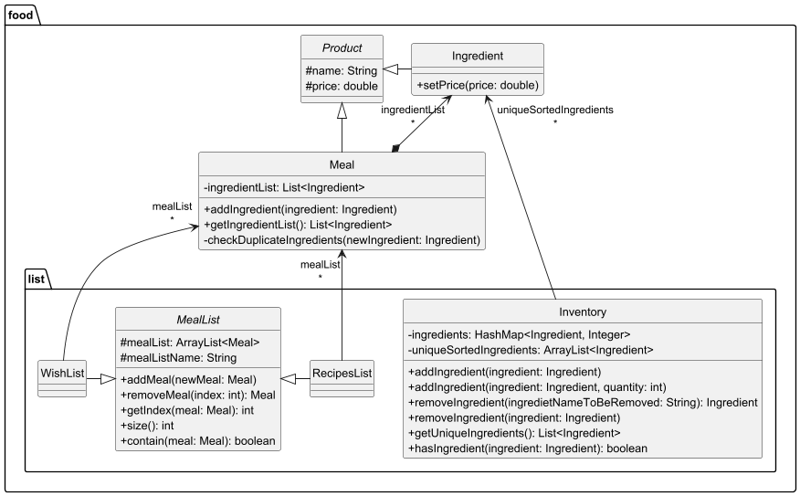

The `Ingredient` class,

* Represents an ingredient, which has a `name` and `price`
* Contains the `setPrice` method, as well as private methods to check that
  the price provided is non-negative, must be in 2 decimal places with at least 1 digit before `.` and able to be parsed
  as a `Double`

The `Meal` class,

* Represents a meal, which has a `name`, `price`, and `ingredientList` of type `List<Ingredient>`.
* Contains the `addIngredient` method that adds an `Ingredient` into its `ingredientList`. While doing so, it
  also retrieves and adds the `price` of the `Ingredient` into the meal's `price`.
* Contains a private method that checks if an `Ingredient` to be added is already duplicated in the `ingredientList`,
* and throws an exception.

### `command`

The `command` package contains the abstract class `Command`, as well as various different subclasses that represent
specific commands, such as `CreateCommand`, `ByeCommand`, `HelpCommand`. The specific commands will be elaborated below.

Note that `FilterCommand` and `SelectCommand` inherit an abstract `FilterSelectCommand` class that inherits from
`Command`. Similarly, `RemoveCommand` and `DeleteCommand` inherit an abstract `RemoveDeleteCommand`. This was
done to abstract out similarities between the pairs of classes.


### Enhancements in the Command Module

Both commands extend the abstract Command class, thereby following our command design pattern to decouple user input
parsing from the actual execution of features.
The primary objective of these commands is to ensure a clear separation of concerns, improve maintainability, and allow
for easier testing.

#### 1. RecipesCommand

##### 1.1 Design Overview

###### Function

RecipesCommand is responsible for fetching the recipes list from the MealManager and displaying them via the
UserInterface.

###### Design Goals

**Single Responsibility:**

- RecipesCommand only deals with retrieving the recipes list and forwarding it to the UI.

**Decoupling:**

- By isolating the command logic from both the UI and data management, future changes in either will have minimal
  impact.

**Testability:**

- The design allows for easy unit testing by injecting a test-specific UI that captures the output.

##### 1.2 Implementation Details

###### Component Level: RecipesCommand Class

- Inherits from the abstract Command class
- Implements the `execute(MealManager mealManager, UserInterface ui)` method
- Uses logging (via `logger.fine`) to trace execution
- Retrieves the recipes list using `mealManager.getRecipesList().getList()`
- Passes the list to the UI's `printMealList` method with the recipesListName: "recipesList"

###### Code Example

```java
public void execute(MealManager mealManager, UserInterface ui) throws EZMealPlanException {
    assert mealManager != null : "MealManager cannot be null";
    logger.fine("Executing 'recipes' command");
    String recipesListName = mealManager.getRecipesList().getMealListName();
    List<Meal> recipesList = mealManager.getRecipesList().getList();
    ui.printMealList(recipesList, recipesListName);
}
```

##### 1.3 Sequence Diagram


##### 1.4 Unit Testing

###### Testing Approach

- A test-specific subclass of UserInterface (named TestUserInterface) is defined to capture the parameters passed to the
  `printMealList` method
- The unit test populates the MealManager's recipes list with sample meals
- Executes RecipesCommand
- Asserts that the UI received the expected label and list of meals

###### Unit Test Code

Here is a snippet of the unit test code:

```java

@Test
public void testExecute_recipesCommand_printsRecipesList() throws EZMealPlanException {
    logger.fine("Running testExecute_recipesCommand_printsRecipesList()");
    MealManager mealManager = new MealManager();
    Meal meal1 = new Meal("Main Meal 1");
    Meal meal2 = new Meal("Main Meal 2");
    mealManager.getRecipesList().getList().add(meal1);
    mealManager.getRecipesList().getList().add(meal2);

    TestUserInterface testUI = new TestUserInterface();
    RecipesCommand recipesCommand = new RecipesCommand();
    recipesCommand.execute(mealManager, testUI);

    assertEquals(mealManager.getRecipesList().getMealListName(), testUI.capturedListName);
    List<Meal> expectedMeals = new ArrayList<>();
    expectedMeals.add(meal1);
    expectedMeals.add(meal2);
    assertIterableEquals(expectedMeals, testUI.capturedMeals);
    logger.info("testExecute_recipesCommand_printsRecipesList() passed");
}
```

#### 2. WishlistCommand

##### 2.1 Design Overview

###### Function

WishlistCommand fetches the wishlist from the MealManager and instructs the UI to display it.

###### Design Goals

**Single Responsibility:**

- WishlistCommand solely handles the retrieval and display of the main meals.

**Decoupling:**

- By segregating responsibilities, it makes the code easier to maintain and extend.

**Testability:**

- The design supports unit testing by allowing a test-specific UI to capture and verify the output.

##### 2.2 Implementation Details

###### Component Level: WishlistCommand Class

- Inherits from the abstract Command class
- Implements the `execute(MealManager mealManager, UserInterface ui)` method
- Uses logging to indicate execution
- Retrieves the wishlist using `mealManager.getWishList().getList()`
- Calls `ui.printMealList` with the wishListName: "wishlist"

###### Code Example

```java
public void execute(MealManager mealManager, UserInterface ui) throws EZMealPlanException {
    assert mealManager != null : "MealManager cannot be null";
    logger.fine("Executing 'wishlist' Command");
    List<Meal> wishList = mealManager.getWishList().getList();
    String wishListName = mealManager.getWishList().getMealListName();
    ui.printMealList(wishList, wishListName);
}
```

##### 2.3 Sequence Diagram

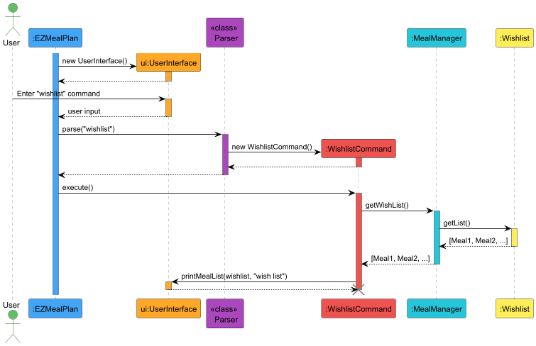

##### 2.4 Unit Testing

###### Testing Approach

- Uses a test-specific TestUserInterface subclass to capture the output of `printMealList`
- Sets up the user wishlist in the MealManager
- Executes WishlistCommand
- Verifies that the UI output matches the expected label and meal list

###### Unit Test Code

Here is a snippet of the unit test code:

```java

@Test
public void testExecute_wishlistCommand_printsUserChosenMeals() throws EZMealPlanException {
    logger.fine("running testExecute_wishlistCommand_printsUserChosenMeals()");
    MealManager mealManager = new MealManager();
    Meal meal1 = new Meal("Meal A");
    Meal meal2 = new Meal("Meal B");
    mealManager.getWishList().getList().add(meal1);
    mealManager.getWishList().getList().add(meal2);

    TestUserInterface testUI = new TestUserInterface();
    WishlistCommand wishlistCommand = new WishlistCommand();
    wishlistCommand.execute(mealManager, testUI);

    assertEquals(mealManager.getWishList().getMealListName(), testUI.capturedListName);
    List<Meal> expectedMeals = new ArrayList<>();
    expectedMeals.add(meal1);
    expectedMeals.add(meal2);
    assertIterableEquals(expectedMeals, testUI.capturedMeals);
    logger.fine("testExecute_wishlistCommand_printsUserChosenMeals() passed");
}
```

#### 3. SelectCommand and SelectChecker

##### 3.1 Design Overview

###### Function

SelectCommand allows the user to select a recipe from the filtered list (obtained via the FilterCommand) by providing
its index, and then adds the selected recipe into the user's wish list. The same meal cannot be added more than once
into the wishlist.

###### Design Goals

- **Single Responsibility:**
    - SelectCommand is solely responsible for validating the user-provided index, retrieving the corresponding recipe
      from the filtered list, and adding that recipe to the wish list.
    - SelectChecker solely handles checking of the Select command input by the user.

- **Decoupling:**
    - By isolating the selection logic from other commands, it becomes easier to maintain and extend without affecting
      other parts of the system.

- **Testability:**
    - The design supports unit testing by using a test-specific SelectCommandTest and SelectCheckerTest to check for the
      matching

##### 3.2 Implementation Details

###### Component Level: SelectChecker Class

- Inherits from the abstract FilterSelectChecker Class, which in turn inherits from the abstract Checker Class.
- Implements the `check()` method.
- Uses logging to indicate execution.
- `isPassed` is set to `true` once the user input passes all the required checks.
- Passes the valid user input back into the SelectCommand class for processing into a new meal.

###### Component Level: SelectCommand Class

- Inherits from the abstract FilterSelectCommand class, which in turn inherits from the abstract Command class.
- Implements the `execute(MealManager mealManager, UserInterface ui)` method.
- Uses logging to indicate execution and to record any input validation issues.
- Validates the user input index using helper methods (getIndexSubstring, checkValidParse, and checkValidInputIndex).
- Retrieves the filtered meal list via the inherited method getFilteredMealList(mealManager).
- Retrieves the wish list from the MealManager.
- Adds the selected recipe to the wish list and calls ui.printAddMealMessage to display a confirmation message.

###### Code Example

FilterSelectChecker Class check():

```java

@Override
public void check() throws EZMealPlanException {
    logger.fine("Checking '" + userInput + "' for errors.");
    checkFilterMethodFormat();
    setPassed(true);
}
```

SelectChecker Class check():

```java

@Override
public void check() throws EZMealPlanException {
    super.check();
    indexStringCheck();
    setPassed(true);
}
```

```java
    public void execute(MealManager mealManager, UserInterface ui) throws EZMealPlanException {
    boolean isValidUserInput = checkValidUserInput(filterOrSelect);
    if (!isValidUserInput) {
        logger.severe(
                "Huge issue detected! The user input format remains invalid despite " + "passing all the checks for input formatting error.");
    }
    assert isValidUserInput;
    List<Meal> filteredMealList = getFilteredMealList(mealManager);
    if (filteredMealList.isEmpty()) {
        System.out.println("The filtered meal list is empty.");
        return;
    }
    String indexSubstring = getIndexSubstring();
    int inputIndex = checkValidParse(indexSubstring);
    Meal selectedMeal = checkValidInputIndex(inputIndex, filteredMealList);
    MealList wishList = mealManager.getWishList();
    mealManager.addMeal(selectedMeal, wishList);
    ui.printAddMealMessage(selectedMeal, wishList);
}
```

##### 3.3 Sequence Diagram

Below are the UML sequence diagrams for the SelectCommand and SelectChecker, illustrating their interactions with the
system components:

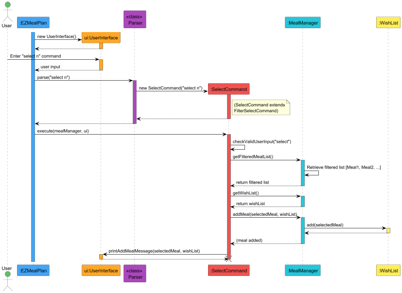
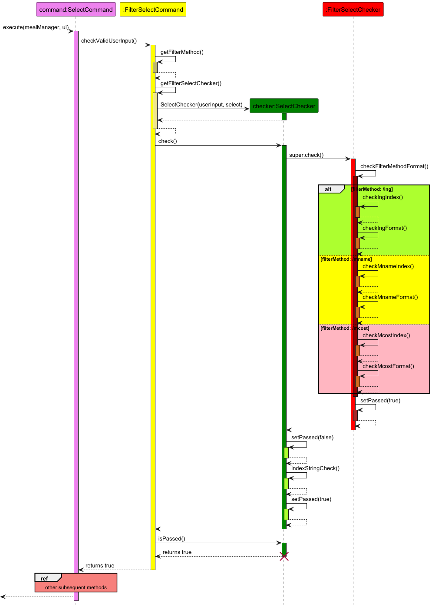

##### 3.4 Unit Testing

###### Testing Approach

- Tests are divided into success and failure scenarios using separate test methods
- A custom logger is set up to track test execution with both console and file handlers
- For successful selection tests:
    - Tests run on both empty and populated meal lists
    - Multiple selection command formats are tested (/mname, /ing, /mcost)
- For failure scenarios, tests verify appropriate exceptions are thrown for:
    - Invalid index formats (non-numeric values)
    - Out-of-range indices (negative, zero, or beyond list size)
    - Invalid price formats and negative prices
    - Duplicate meal selections (attempting to add the same meal twice)
- The test utilizes preset meals loaded from Storage to populate the meal list
- Each test verifies expected exception messages match actual exception messages
-

###### Unit Test Code

Here is a snippet of the unit test code:

```java

@Test
public void selectCommand_success() {
    mealManager.getRecipesList().getList().clear();
    mealManager.getWishList().getList().clear();
    logger.fine("running selectCommand_success()");
    String[] validSelectCommands = {"select 2 /mname a", "select 1 /ing b,c", "select 2 /mcost 2", "select 4 /mname Mname", "select 2 /ing Ing", "select 1 /mcost 5"};
    runValidSelectCommands(validSelectCommands);
    addMeals();
    runValidSelectCommands(validSelectCommands);
    logger.info("selectCommand_success() passed");
}

@Test
public void selectCommand_fail() {
    logger.fine("running selectCommand_fail()");
    mealManager.getRecipesList().getList().clear();
    mealManager.getWishList().getList().clear();
    addMeals();
    checkInvalidPrice();
    checkSelectDuplicateMeal();
    checkInvalidSelectIndex();
    checkIndexOutOfRange();
    logger.info("selectCommand_fail() passed");
}
```

#### 4. ByeCommand

##### 4.1 Design Overview

###### Function

ByeCommand saves the meals from recipesList and wishList into "recipesList.txt" and "wishList.txt" as well as the
ingredients from inventory into "inventory.txt" before exiting the program.

###### Design Goals

- **Single Responsibility:**
    - ByeCommand is solely responsible for saving the meals and ingredients into the respective .txt files before
      shutting down.

- **Decoupling:**
    - By isolating the selection logic from other commands, it becomes easier to maintain and extend without affecting
      other parts of the system.

- **Testability:**
    - The design supports unit testing by using a test-specific class ByeCommandTest to check for the expected output
      and matching the file contents to the expected recipes list, wishlist and inventory list.

##### 4.2 Implementation Details

###### Component Level: ByeCommand Class

- Implements the `execute(MealManager mealManager, UserInterface ui)` method.
- Uses logging to indicate execution and to record any input validation issues.
- Interacts with the MealManager and the Inventory class to retrieve the recipesList, wishList and ingredients
  respectively.
- Interacts with the Storage Class to write the meals from both recipesList and wishList and to write the ingredients
  from inventory list into the .txt files recipesList.txt, wishList.txt and inventory.txt respectively.
- User interface prints goodbye message before it outputs the isExit = `true` to break out of the `while` loop for
  EZMealPlan.

###### Code Example

```java

@Override
public void execute(MealManager mealManager, UserInterface ui) {
    updateRecipesListFile(mealManager, ui);
    updateWishListFile(mealManager, ui);
    updateInventoryFile(mealManager, ui);
    ui.printGoodbye();
}
```

##### 4.3 Sequence Diagram

This sequence diagram illustrates the general flow of the ByeCommand process and the interactions between the ByeCommand
class
and other relevant classes.
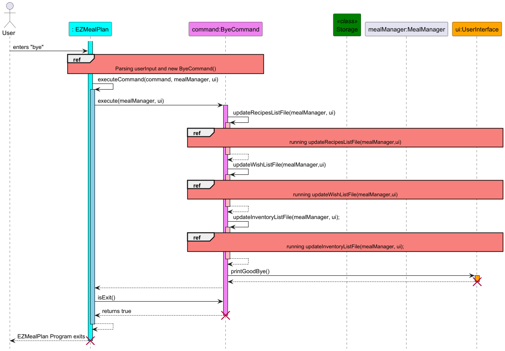

This sequence diagram illustrates the process of updating the recipes list file based on the current meals that are
available in the recipes list.

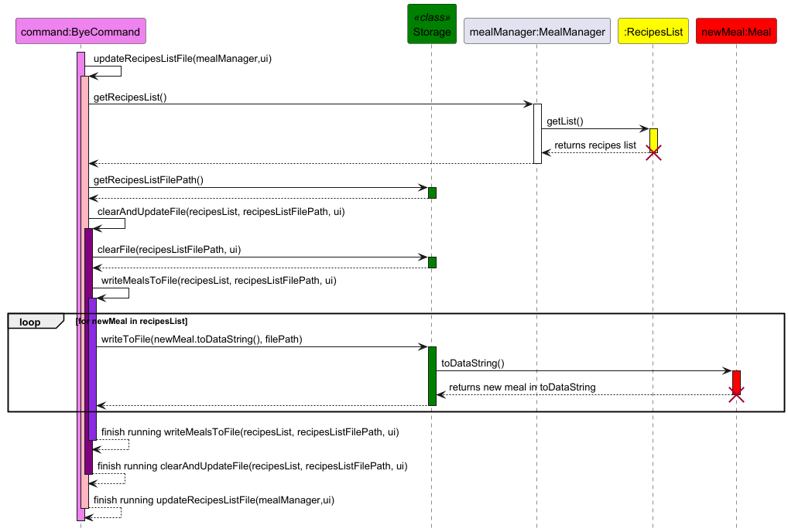

The general flow of updating the wishlist file (`updateWishListFile(mealManager, ui)`) and inventory file (
`updateInventoryListFile(mealManager,ui)`) are similar to the flow of updating the recipes file with the only difference
being the recipes list file and wishlist file store meals
whereas the inventory file store ingredients. A code snippet is shown below to address the similarity and difference:

```java
private void updateWishListFile(MealManager mealManager, UserInterface ui) {
    List<Meal> wishList = mealManager.getWishList().getList();
    String wishListFilePath = Storage.getWishListFilePath();
    clearAndUpdateFile(wishList, wishListFilePath, ui);
}

private void updateRecipesListFile(MealManager mealManager, UserInterface ui) {
    List<Meal> recipesList = mealManager.getRecipesList().getList();
    String recipesListFilePath = Storage.getRecipesListFilePath();
    clearAndUpdateFile(recipesList, recipesListFilePath, ui);
}

private void updateInventoryListFile(MealManager mealManager, UserInterface ui) {
    // Retrieve the list of ingredients from the inventory.
    List<Ingredient> ingredientList = mealManager.getInventory().getIngredients();
    // Get the file path for the inventory list.
    String inventoryListFilePath = Storage.getInventoryListFilePath();
    // Clear the existing file and write the new list.
    clearAndUpdateFileForIngredients(ingredientList, inventoryListFilePath, ui);
}
```

##### 4.4 Unit Testing

###### Testing Approach

- Tests are divided into 2 parts for the success run.
- A custom logger is set up to track test execution with both console and file handlers.
- As the ByeCommandTest will overwrite the recipesList.txt, wishList.txt and inventoryList.txt files, the files contents
  will be transferred over into temporary files before the actual checks take place.
- The first check is ensuring that the goodbye message is being printed when the program exits.
- The second check is to compare whether the file contents match the meals/ingredients present in the lists as expected.
  If both sides have a complete match, it indicates that the ByeCommand works fine and the meals/ingredients are
  properly saved into the files.
- Once both checks are completed, the files contents will be transferred back into the recipesList.txt, wishList.txt and
  inventoryList.txt from the temporary files.

###### Unit Test Code

Here is a snippet of the unit test code:

```java

@Test
public void byeCommandTest_success() {
    logger.fine("running byeCommandTest_success()");
    try {
        Storage.createListFiles();
        List<Meal> mealsList = Storage.loadPresetMeals();
        Storage.loadExistingInventory(mealManager);
        List<Meal> expectedRecipesList = getExpectedRecipesList(mealsList);
        List<Meal> expectedWishList = getExpectedWishList(mealsList);
        List<Ingredient> expectedInventoryList = getExpectedInventoryList();
        List<File> latestFiles = saveLatestLists();
        expectedGoodByeMessage_success();
        compareFileAndExpectedLists_success(expectedRecipesList, expectedWishList, expectedInventoryList, latestFiles);
        logger.info("byeCommandTest_success() passed");
    } catch (Exception exception) {
        ui.printErrorMessage(exception);
        logger.severe("byeCommandTest_success() should not fail");
        fail();
    }
}
```

### 5. CreateCommand and CreateChecker

##### 5.1 Design Overview

###### Function

CreateChecker checks if the user input is valid before passing to the CreateCommand to create a new meal from the user
input and adds it into the recipes list.

###### Design Goals

**Single Responsibility:**

- CreateCommand solely handles the creation and adding of new meal into the recipes list while
  CreateChecker solely handles checking of the Create command input by the user.

**Decoupling:**

- By segregating responsibilities, it makes the code easier to maintain and extend.

**Testability:**

- The design supports unit testing by allowing test-specific CreateCommandTest and CreateCheckerTest to capture and
  verify the output.

##### 5.2 Implementation Details

###### Component Level: CreateChecker Class

- Inherits from the abstract Checker Class.
- Implements the `check()` method.
- Uses logging to indicate execution.
- `isPassed` is set to `true` once the user input passes all the required checks.
- Passes the valid user input back into the CreateCommand class for processing into a new meal.

###### Component Level: CreateCommand Class

- Inherits from the abstract Command class.
- Implements the `execute(MealManager mealManager, UserInterface ui)` method.
- Uses logging to indicate execution.
- Creates a new meal and passes it to the MealManager for adding the meal into the recipes list.

###### Code Example

```java

@Override
public void check() throws EZMealPlanException {
    logger.fine("Checking '" + userInput + "' for errors.");
    checkMnameExists();
    checkIngExists();
    checkMnameIngIndexes();
    checkMealNameExists();
    checkIngredientExists();
    checkIngredientFormat();
    setPassed(true);
}
```

```java

@Override
public void execute(MealManager mealManager, UserInterface ui) throws EZMealPlanException {
    boolean isValidUserInput = checkValidUserInput();
    if (!isValidUserInput) {
        logger.severe(
                "Huge issue detected! The user input format remains invalid despite " + "passing all the checks for input formatting error.");
    }
    assert isValidUserInput;

    Meal newMeal = createNewMeal();
    MealList recipesList = mealManager.getRecipesList();
    mealManager.addMeal(newMeal, recipesList);
    ui.printAddMealMessage(newMeal, recipesList);
}
```

##### 5.3 Sequence Diagrams

Here are Sequence Diagrams depicting the flow of the processing of user inputs into a new meal:
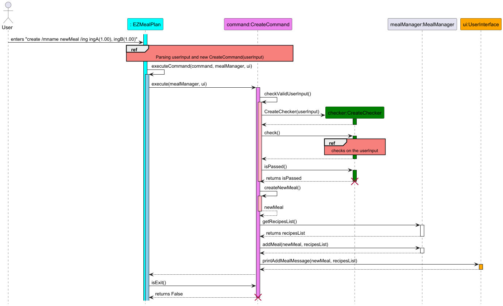
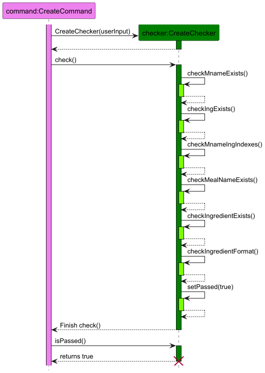

##### 5.4 Unit Testing

###### Testing Approach

- Uses a test-specific CreateCheckerTest and CreateCommandTest to ensure that the CreateChecker and CreateCommand
  account for different types of user inputs and proceed as normal.
- Test with different types of user inputs that gives no error and some exceptions.
- Executes CreateChecker and CreateCommand.
- Verifies that the exceptions are thrown according to the user inputs.

###### Unit Test Code

Here are some snippets of the unit test code:

```java

@Test
public void createCommand_fail() {
    logger.fine("running createCommand_fail()");
    duplicate_ingredient_catch();
    duplicate_meal_catch();
    invalidPriceFormat();
    logger.info("createCommand_fail() test passed");
}
```

```java

@Test
public void createChecker_fail() {
    logger.fine("Running createChecker_fail()");
    checkMissingMname();
    checkMissingIng();
    checkInvalidCreateIndex();
    checkInvalidIngMnameIndex();
    checkMissingMealName();
    checkMissingIngredient();
    checkInvalidIngredientFormat();
    logger.info("createChecker_fail() passed");
}
```

#### 6. DeleteCommand

* RemoveDeleteChecker will be explained with RemoveCommand.

##### 6.1 Design Overview

###### Function

DeleteCommand is responsible for removing a specific meal from the recipes list and, if applicable, also removing the
same meal from the user's wishlist. It ensures consistency between related lists and provides user feedback via the
UserInterface.

###### Design Goals

**Consistency**

- Ensures that if a meal is deleted from the main list, it is also removed from the wish list to prevent dangling
  references.

**Single Responsibility**

- Focuses purely on deletion logic while relying on MealManager for list access and UserInterface for message display.

**Extensibility**

- Built on top of the shared abstract class RemoveDeleteCommand, which allows common functionality (like index parsing
  and list access) to be reused across similar commands (e.g., RemoveCommand).

##### 6.2 Implementation Details

###### Component Level: DeleteCommand Class

- Inherits from the abstract `RemoveDeleteCommand` class, which in turn inherits from the abstract `Command` class.
- Implements the `execute(MealManager mealmanager, UserInterface ui)` method.
- Uses logging (via `logger.fine(...)` to indicate successful deletion.
- Retrieves the main meal list using `mealManager.getMainMeals()` (inherited logic).
- Removes the meal at the specified index (inherited logic).
- Retrieves the wish list using `mealManager.getWishList()`.
- Checks if the deleted meal exists in the wish list using `wishlist.contains(...)`.
- If it exists, removes it using `wishList.removeMeal(...)`.
- Calls `ui.printRemovedMessage(...)` to notify the user of removal from the wish list.

###### Code Example

```java

@Override
public void execute(MealManager mealManager, UserInterface ui) throws EZMealPlanException {
    super.execute(mealManager, ui);
    Meals userMeals = mealManager.getUserMeals();
    if (userMeals.contains(removedOrDeletedMeal)) {
        int indexInUserList = userMeals.getIndex(removedOrDeletedMeal);
        userMeals.removeMeal(indexInUserList);
        ui.printRemovedMessage(removedOrDeletedMeal, userMeals.size());
        logger.fine(
                "Command finished executing: Removed \"" + removedOrDeletedMeal.getName() + "\" meal " + "from user list");
    }
    logger.fine(
            "Command finished executing: Deleted \"" + removedOrDeletedMeal.getName() + "\" meal from " + "main list");
}
```

##### 6.3 Sequence Diagram

Here is the sequence diagram for illustrating the interactions between different classes while processing the user
input:
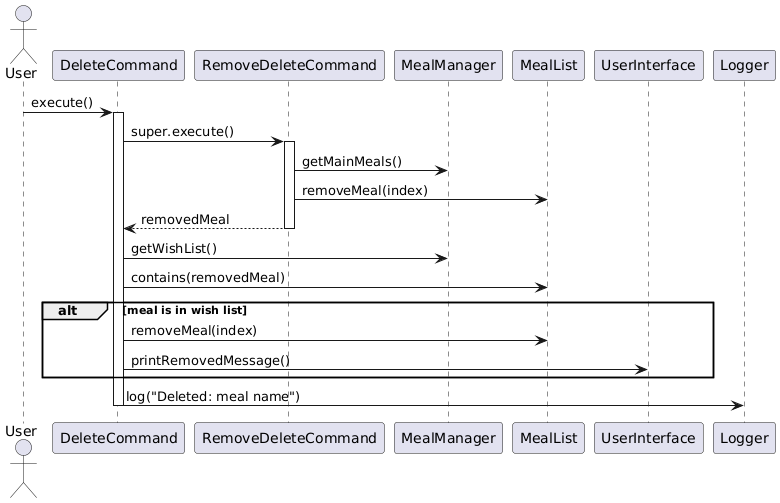

##### 6.4 Unit Testing

###### Testing Approach

- Uses a test-specific DeleteCommandTest to ensure that the DeleteCommand account for different types of user inputs and
  proceed as normal.
- Test with different types of user inputs that gives no error and some exceptions.
- Executes DeleteCommand.
- Verifies that the exceptions are thrown according to the user inputs.

###### Unit Test Code

Here is a snippet of the unit test code:

```java

@Test
public void deleteCommand_validRecipeIndex_success() throws EZMealPlanException {
    logger.fine("Running deleteCommand_validRecipeIndex_success()");
    MealManager mealManager = new MealManager();
    mealManager.getRecipesList().getList().clear();

    Meal testMeal = new Meal("Egg Fried Rice");
    mealManager.getRecipesList().getList().add(testMeal);

    List<Meal> recipes = mealManager.getRecipesList().getList();
    assertEquals(1, recipes.size());
    assertEquals("Egg Fried Rice", recipes.get(0).getName());

    DeleteCommand deleteCommand = new DeleteCommand("delete 1");
    deleteCommand.execute(mealManager, new TestUI());

    assertEquals(0, recipes.size());
    logger.info("deleteCommand_validRecipeIndex_success passed");
}

@Test
public void deleteCommand_extraSpacingInput_success() throws EZMealPlanException {
    logger.fine("Running deleteCommand_extraSpacingInput_success()");
    MealManager mealManager = new MealManager();
    mealManager.getRecipesList().getList().clear();

    Meal testMeal = new Meal("Soup");
    mealManager.getRecipesList().getList().add(testMeal);

    List<Meal> recipes = mealManager.getRecipesList().getList();
    assertEquals(1, recipes.size());

    DeleteCommand deleteCommand = new DeleteCommand("   delete     1   ");
    deleteCommand.execute(mealManager, new TestUI());

    assertEquals(0, recipes.size());
    logger.info("deleteCommand_extraSpacingInput_success passed");
}
```

### 7. FilterCommand and FilterChecker

##### 7.1 Design Overview

###### Function

FilterChecker checks if the user input is valid before passing to the FilterCommand to filter recipes list into the
wishlist based on the user input.

###### Design Goals

**Single Responsibility:**

- FilterCommand solely handles the filtering of the recipes list according to the user input while FilterChecker solely
  handles the checking of the Filter command inputted by the user.

**Decoupling:**

- By segregating responsibilities, it makes the code easier to maintain and extend.

**Testability:**

- The design supports unit testing by allowing test-specific FilterCommandTest and FilterCheckerTest to capture and
  verify the output.

##### 7.2 Implementation Details

###### Component Level: FilterChecker Class

- Inherits from the abstract FilterSelectChecker Class, which in turn inherits from the abstract Checker Class.
- Implements the `check()` method.
- Uses logging to indicate execution.
- `isPassed` is set to `true` once the user input passes all the required checks.
- Passes the valid user input back into the FilterCommand class for filtering the recipes list.

###### Component Level: FilterCommand Class

- Inherits from the abstract FilterSelectCommand Class, which in turn inherits from the abstract Command class.
- Implements the `execute(MealManager mealManager, UserInterface ui)` method.
- Uses logging to indicate execution.
- Filters the recipes list according to the user input.

###### Code Example

FilterSelectChecker check() method:

```java

@Override
public void check() throws EZMealPlanException {
    logger.fine("Checking '" + userInput + "' for errors.");
    checkFilterMethodFormat();
    setPassed(true);
}
```

FilterChecker check() method:

```java

@Override
public void check() throws EZMealPlanException {
    super.check();
}
```

```java

@Override
public void execute(MealManager mealManager, UserInterface ui) throws EZMealPlanException {
    boolean isValidUserInput = checkValidUserInput(filterOrSelect);
    if (!isValidUserInput) {
        logger.severe(
                "Huge issue detected! The user input format remains invalid despite " + "passing all the checks for input formatting error.");
    }
    assert isValidUserInput;
    List<Meal> filteredMealList = getFilteredMealList(mealManager);
    printFilteredMealList(filteredMealList, ui);
}
```

##### 7.3 Sequence Diagrams

Here are Sequence Diagrams depicting the interactions between the FilterCommand, FilterChecker and other system
component classes:

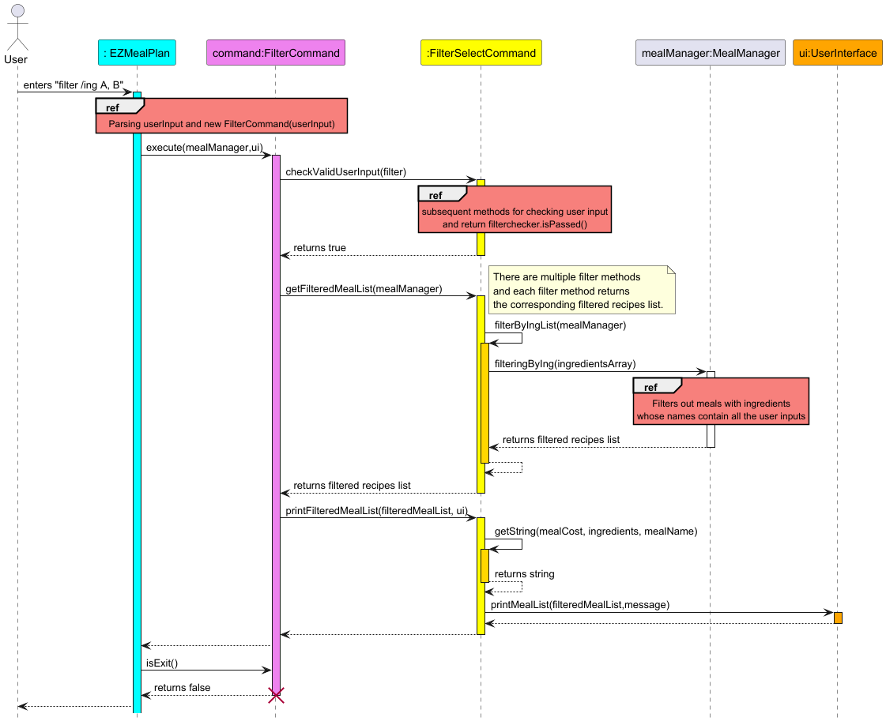
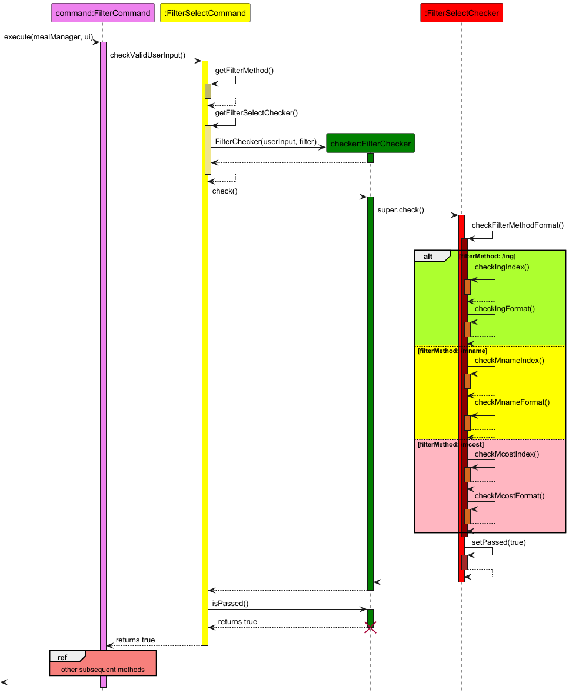

For the `/mcost` and `/mname` filtering methods, their flow will be different from the one shown in the FilterCommand
sequence diagram above.

For the `/mname` filtering method, simply replace:

* `filterByIngList` method &rarr; `filterByMnameList` method
* `mealManager.filteringByIng` method &rarr; `mealManager.filteringByMname` method

For the `/mcost` filtering method, simply replace:

* `filterByIngList` method &rarr; `filterByMcostList` method
* `mealManager.filteringByIng` method &rarr; `mealManager.filteringByMcost` method
* And include: `checkValidMcostPrice` method to check the user input for `/mcost`.

##### 7.4 Unit Testing

###### Testing Approach

- Uses a test-specific FilterCheckerTest and FilterCommandTest to ensure that the FilterChecker and FilterCommand
  account for different types of user inputs and proceed as normal.
- Test with different types of user inputs that gives no error and some exceptions.
- Executes FilterChecker and FilterCommand.
- Verifies that the exceptions are thrown according to the user inputs.

###### Unit Test Code

Here are some snippets of the unit test code:

```java

@Test
public void filterChecker_success() throws EZMealPlanException {
    logger.info("running filterchecker_success()");
    String[] validFilterStrings = {"filter /mname a", "filter /mname a,b", "filter /ing c", "filter /ing c,d", "filter /mcost 1"};
    for (String filterString : validFilterStrings) {
        String filterMethod = getFilterMethod(filterString);
        FilterChecker checker = new FilterChecker(filterString, filterMethod);
        checker.check();
        assertTrue(checker.isPassed());
        logger.info("Valid filter command input.");
    }
    logger.info("filterChecker_success() passed");
}
```

```java

@Test
public void filterCommand_success() {
    mealManager.getRecipesList().getList().clear();
    logger.fine("running filterCommand_success()");
    String[] validFilterCommands = {"filter /mname a", "filter /ing b,c", "filter /mcost 2.00", "filter /mname " + "Mname", "filter /ing Ing", "filter /mcost 5.00"};
    runValidFilterCommands(validFilterCommands);
    addMeals();
    runValidFilterCommands(validFilterCommands);
    logger.info("filterCommand_success() passed");
}
```

### 8. RemoveCommand and RemoveDeleteChecker

##### 8.1 Design Overview

###### Function

RemoveDeleteChecker checks if the user input is valid before passing to the RemoveCommand to remove a meal from the
wishlist (when it is not empty) based on the user input.

###### Design Goals

**Single Responsibility:**

- RemoveCommand solely handles the removing of meal from the wishlist according to the user input while
  RemoveDeleteChecker solely handles the checking of the Remove command inputted by the user.

**Decoupling:**

- By segregating responsibilities, it makes the code easier to maintain and extend.

##### 8.2 Implementation Details

###### Component Level: RemoveDeleteChecker Class

- Inherits from the abstract Checker Class.
- Implements the `check()` method.
- Uses logging to indicate execution.
- `isPassed` is set to `true` once the user input passes all the required checks.
- Passes the valid user input back into the RemoveCommand class for removing a meal from the wishlist.
-

###### Component Level: RemoveCommand Class

- Inherits from the abstract RemoveDeleteCommand Class, which in turn inherits from the abstract Command class.
- Implements the `execute(MealManager mealManager, UserInterface ui)` method.
- Uses logging to indicate execution.
- Removes a meal from the wishlist according to the user input.

###### Code Example

```java 

@Override
public void check() throws EZMealPlanException {
    logger.fine("Checking '" + userInput + "' for errors.");
    String indexString = extractIndex(userInput);
    parseIndex(indexString);
    setPassed(true);
}
```

RemoveDeleteCommand execute() method:

```java

@Override
public void execute(MealManager mealManager, UserInterface ui) throws EZMealPlanException {
    MealList wishList = mealManager.getWishList();
    MealList recipesList = mealManager.getRecipesList();
    int indexOfIndex = 1;

    boolean isValidUserInput = checkValidUserInput();
    if (!isValidUserInput) {
        logger.severe(
                "Huge issue detected! The user input format remains invalid despite " + "passing all the checks for input formatting error.");
    }
    assert isValidUserInput;
    String regexPattern = "\\s+";
    int indexAdjustment = 1;
    int index = Integer.parseInt(validUserInput.split(regexPattern)[indexOfIndex]) - indexAdjustment;
    if (removeOrDelete.equals(remove)) {
        removedOrDeletedMeal = mealManager.removeMeal(index, wishList);
        ui.printRemovedMessage(removedOrDeletedMeal, wishList.size());
    } else if (removeOrDelete.equals(delete)) {
        removedOrDeletedMeal = mealManager.removeMeal(index, recipesList);
        ui.printDeletedMessage(removedOrDeletedMeal, recipesList.size());
    }
}
```

RemoveCommand execute() method:

```java

@Override
public void execute(MealManager mealManager, UserInterface ui) throws EZMealPlanException {
    super.execute(mealManager, ui);
    logger.fine("Command finished executing: Removed \"" + removedOrDeletedMeal.getName() + "\" meal");
}
```

##### 8.3 Sequence Diagrams

Here are Sequence Diagrams depicting the interactions between the RemoveCommand, RemoveDeleteChecker and other system
component classes:

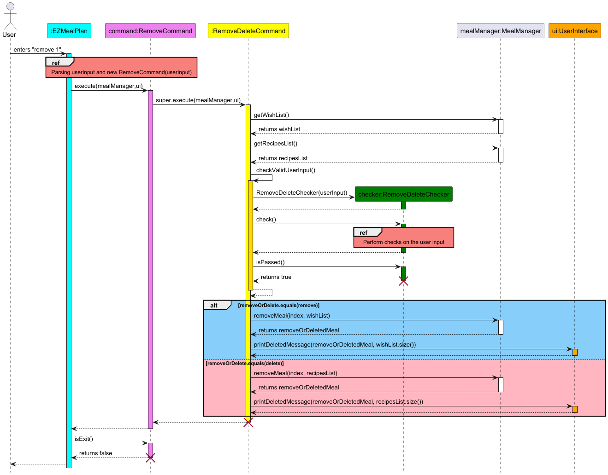
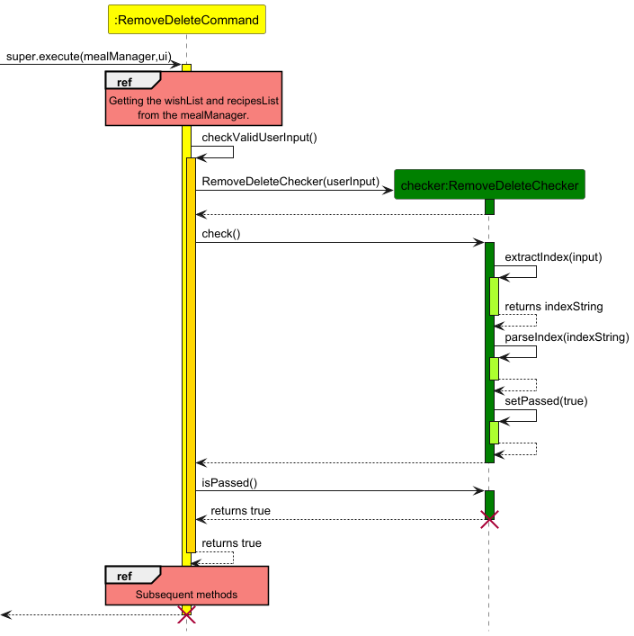

##### 8.4 Unit Testing

###### Testing Approach

- Uses a test-specific RemoveDeleteCheckerTest and RemoveCommandTest to ensure that the RemoveDeleteChecker and
  RemoveCommand account for different types of user inputs and proceed as normal.
- Test with different types of user inputs that gives no error and some exceptions.
- Executes RemoveDeleteChecker and RemoveCommand.
- Verifies that the exceptions are thrown according to the user inputs.

###### Unit Test Code

Here are some snippets of the unit test code:

```java

@Test
public void removeDeleteChecker_expectedInputs_success() throws EZMealPlanException {
    logger.fine("Running removeDeleteChecker_expectedInputs_success()");
    String validUserInput = "remove 1";
    RemoveDeleteChecker checker = new RemoveDeleteChecker(validUserInput);
    checker.check();
    assertTrue(checker.isPassed());
    logger.info("removeDeleteChecker_expectedInputs_success() passed");
}

@Test
public void parseIndex_nonIntegerIndex_exceptionThrown() {
    logger.fine("Running parseIndex_nonIntegerIndex_exceptionThrown()");
    String validUserInput = "remove t";
    RemoveDeleteChecker checker = new RemoveDeleteChecker(validUserInput);
    try {
        checker.check();
        fail();
    } catch (EZMealPlanException ezMealPlanException) {
        assertEquals(new RemoveFormatException(validUserInput).getMessage(), ezMealPlanException.getMessage());
        logger.info("parseIndex_nonIntegerIndex_exceptionThrown() passed");
    }
}
```

```java

@Test
public void removeCommand_extraSpacingInput_success() throws EZMealPlanException {
    logger.fine("Running removeCommand_extraSpacingInput_success()");
    MealManager mealManager = new MealManager();
    Meal testMeal = new Meal("Soup");
    MealList wishList = mealManager.getWishList();
    wishList.addMeal(testMeal);
    assertEquals(1, wishList.size());

    Command command = new RemoveCommand("   remove     1   ");
    command.execute(mealManager, testUI);

    assertEquals(0, wishList.size());
    logger.info("Meal successfully removed from wish list");
}

@Test
public void removeCommand_emptyList_throwsEmptyListException() throws EZMealPlanException {
    logger.fine("Running removeCommand_emptyList_throwsRemoveFormatException()");
    MealManager mealManager = new MealManager();

    String[] userInputs = {"remove 1", "remove 0", "remove -1"};
    for (String userInput : userInputs) {
        Command command = new RemoveCommand(userInput);
        assertThrows(EmptyListException.class, () -> command.execute(mealManager, testUI));
        logger.info("Correct exception thrown");
    }
}

```

### 9. ClearCommand

##### 9.1 Design Overview

###### Function

ClearCommand clears the wishlist.

###### Design Goals

**Single Responsibility:**

- ClearCommand solely handles the clearing of the wishlist according to the user input.

**Decoupling:**

- By segregating responsibilities, it makes the code easier to maintain and extend.

**Testability:**

- The design supports unit testing by allowing test-specific ClearCommandTest to capture and verify the output.

##### 9.2 Implementation Details

###### Component Level: RemoveCommand Class

- Inherits from the abstract Command class.
- Implements the `execute(MealManager mealManager, UserInterface ui)` method.
- Uses logging to indicate execution.
- Clears the wishlist according to the user input.

###### Code Example

```java

@Override
public void execute(MealManager mealManager, UserInterface ui) {
    List<Meal> wishList = mealManager.getWishList().getList();
    wishList.clear();
    ui.printClearedList();
}
```

##### 9.3 Sequence Diagram

Here is the sequence diagram depicting the interactions between ClearCommand and other system component classes:

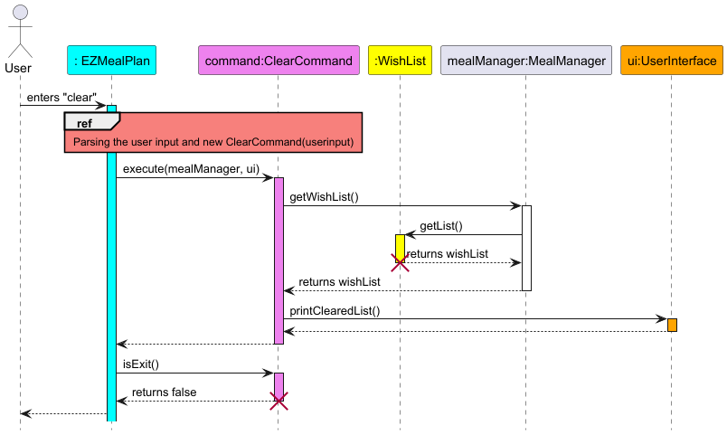

##### 9.4 Unit Testing

###### Testing Approach

- Uses a test-specific ClearCommandTest to ensure that the ClearCommand account for different types of user inputs,
  handles exceptions for erroneous inputs and proceed as normal.
- Test by adding the wishlist with some meals.
- Executes ClearCommand.
- Checks that the wishlist is empty after running the ClearCommand and the expected message about the wishlist being
  cleared is being printed normally.

###### Unit Test Code

Here is a snippet of the unit test code:

```java

@Test
void clearsWishList_noInputs_printsMessage() throws EZMealPlanException {
    logger.fine("running execute_clearsWishList_printsMessage()");

    // Prepare wishlist with some meals
    MealList wishList = mealManager.getWishList();
    wishList.addMeal(new Meal("Chicken Rice"));
    wishList.addMeal(new Meal("Pasta"));

    // Ensure wishList is not empty before clearing
    assertEquals(2, wishList.getList().size(), "Wishlist should contain 2 meals before clearing.");

    // Execute ClearCommand
    ClearCommand clearCommand = new ClearCommand();
    clearCommand.execute(mealManager, ui);

    // Verify wishList is now empty
    assertTrue(wishList.getList().isEmpty(), "Wishlist should be empty after ClearCommand.");

    // Verify output
    String expectedOutput = "All meals cleared from your wishlist!" + ls;
    assertEquals(expectedOutput, outContent.toString(), "Command output does not match expected message.");

    logger.info("execute_clearsWishList_printsMessage() passed");
}
```

### 10. ViewCommand and ViewChecker

##### 10.1 Design Overview

###### Function

ViewChecker checks for the validity of the user input before passing to the ViewCommand for processing and retrieving
the ingredient list of the selected meal from the recipes list or wishlist according to the meal index and the list
stated in the user input.

###### Design Goals

**Single Responsibility:**

- ClearCommand solely handles the clearing of the wishlist according to the user input.

**Decoupling:**

- By segregating responsibilities, it makes the code easier to maintain and extend.

**Testability:**

- The design supports unit testing by allowing test-specific ViewCommandTest and ViewCheckerTest to capture and verify
  the output.

##### 10.2 Implementation Details

###### Component Level: ViewChecker Class

- Inherits from the abstract ViewChecker Class, which in turn inherits from the abstract Checker Class.
- Implements the `check()` method.
- Uses logging to indicate execution.
- `isPassed` is set to `true` once the user input passes all the required checks.
- Passes the valid user input back into the ViewCommand class for extracting the ingredient list of the meal with the
  corresponding index from either the recipes list or the wishlist.

###### Component Level: ViewCommand Class

- Inherits from the abstract Command Class.
- Implements the `execute(MealManager mealManager, UserInterface ui)` method.
- Uses logging to indicate execution.
- Extracts the ingredient list of the meal with the corresponding index from either the recipes list or the wishlist (if
  the list is not empty) according to the user input.

###### Code Example

```java

@Override
public void check() throws EZMealPlanException {
    checkValidKeywordIndex();
    checkMissingMealIndex();
    checkParseMealIndex();
    setPassed(true);
}
```

```java

@Override
public void execute(MealManager mealManager, UserInterface ui) throws EZMealPlanException {
    setRecipesOrWishlist();
    boolean isValidUserInput = checkValidUserInput();
    if (!isValidUserInput) {
        logger.severe(
                "Huge issue detected! The user input format remains invalid despite " + "passing all the checks for input formatting error.");
    }
    assert isValidUserInput;
    viewMeal(recipesOrWishlist, mealManager, ui);
}
```

##### 10.3 Sequence Diagram

Here are the sequence diagrams depicting the interactions between ViewCommand, ViewChecker and other system component
classes:
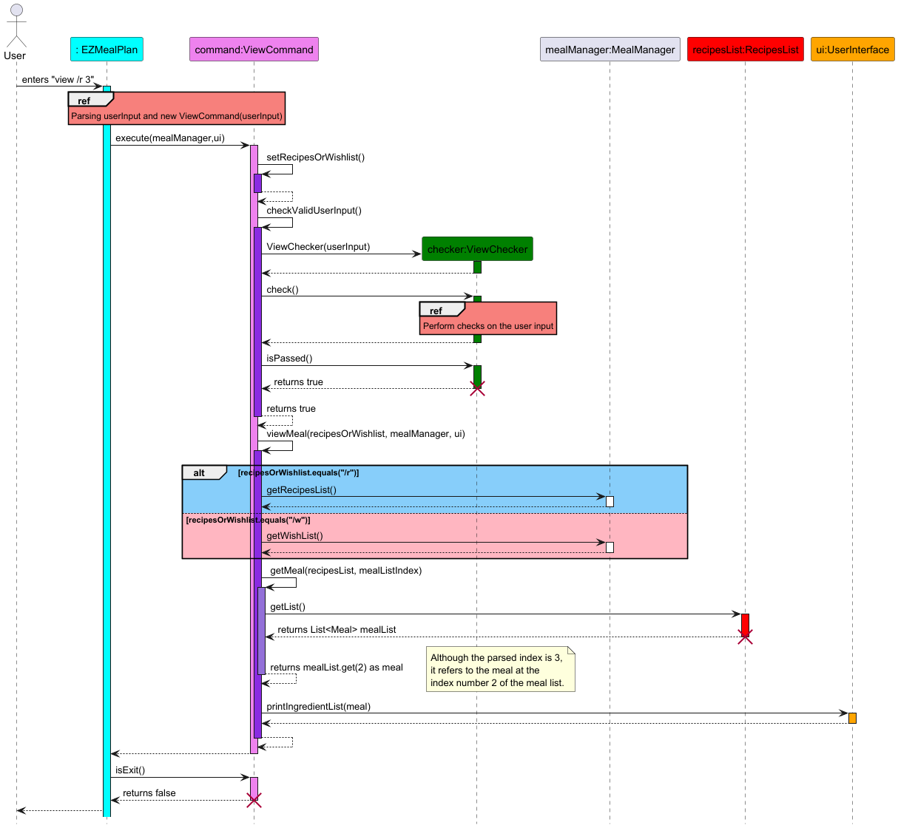
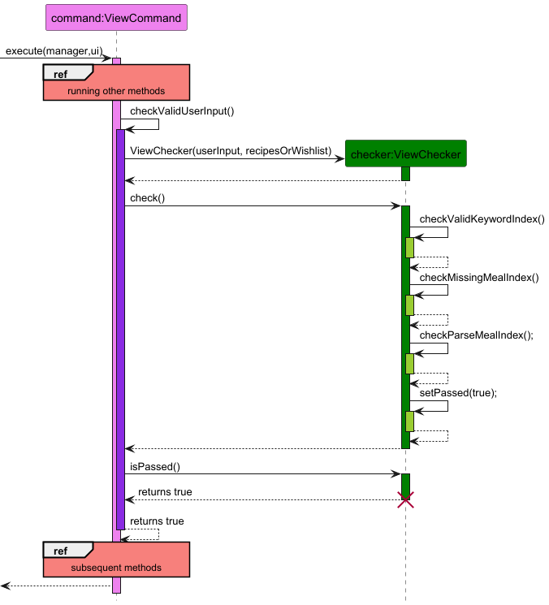

##### 10.4 Unit Testing

###### Testing Approach

- Uses a test-specific ViewCheckerTest and ViewCommandTest to ensure that the ViewChecker and ViewCommand account for
  different types of user inputs and proceed as normal.
- Test with different types of user inputs that gives no error and some exceptions.
- Executes ViewChecker and ViewCommand.
- Verifies that the exceptions are thrown according to the user inputs.

###### Unit Test Code

Here are some snippets of the unit test code:

```java

@Test
public void viewChecker_validWishlistIndex_success() throws EZMealPlanException {
    logger.fine("Running viewChecker_validWishlistIndex_success()");
    ViewChecker checker = new ViewChecker("view /w 1", "/w");
    checker.check();
    logger.info("viewChecker_validWishlistIndex_success passed");
}

@Test
public void viewChecker_keywordBeforeView_throwsInvalidKeywordIndexException() {
    logger.fine("Running viewChecker_keywordBeforeView_throwsInvalidKeywordIndexException()");
    ViewChecker checker = new ViewChecker("/r view 1", "/r");
    assertThrows(InvalidKeywordIndexException.class, checker::check);
    logger.info("viewChecker_keywordBeforeView_throwsInvalidKeywordIndexException passed");
}
```

```java

@Test
public void testExecute_viewRecipeMeal_success() throws EZMealPlanException {
    logger.fine("Running testExecute_viewRecipeMeal_success()");

    MealManager mealManager = new MealManager();
    Meal meal1 = new Meal("Recipes Meal 1");
    Ingredient firstIngredient = new Ingredient("egg", "0.50");
    Ingredient secondIngredient = new Ingredient("rice", "1.00");
    meal1.addIngredient(firstIngredient);
    meal1.addIngredient(secondIngredient);

    mealManager.getRecipesList().getList().add(meal1);

    ViewCommandTest.TestUserInterface testUI = new ViewCommandTest.TestUserInterface();
    ViewCommand viewCommand = new ViewCommand("view /r 1");
    viewCommand.execute(mealManager, testUI);

    assertEquals("Recipes Meal 1 ($1.50)", testUI.capturedMeal.toString());
    List<Ingredient> expectedIngredients = new ArrayList<>();
    expectedIngredients.add(firstIngredient);
    expectedIngredients.add(secondIngredient);
    expectedIngredients.sort(Comparator.comparing(Ingredient::getName, String.CASE_INSENSITIVE_ORDER)
            .thenComparing(Ingredient::getPrice));
    assertIterableEquals(expectedIngredients, testUI.capturedIngredients);

    logger.info("testExecute_viewRecipeMeal_success passed");
}
```

### 11. HelpCommand

##### 11.1 Design Overview

###### Function

HelpCommand redirects the UI to print the messages of the command that the user has doubt with. The messages will
briefly state what the command does, the respective input and the expected output.

###### Design Goals

**Single Responsibility:**

- HelpCommand solely handles the directing of the help messages to be printed by the user interface according to the
  command that the user has doubt with or is being inputted.

**Decoupling:**

- By segregating responsibilities, it makes the code easier to maintain and extend.

**Testability:**

- The design supports unit testing by allowing test-specific HelpCommandTest to capture and verify the output.

##### 11.2 Implementation Details

###### Component Level: HelpCommand Class

- Inherits from the abstract Command Class.
- Implements the `execute(MealManager mealManager, UserInterface ui)` method.
- Uses logging to indicate execution.
- Choose the respective help message to be printed by the user interface based on the command that the user inputted.

###### Code Example

```java

@Override
public void execute(MealManager mealManager, UserInterface ui) {
    if (commandDescription.isEmpty()) {
        ui.printGeneralHelp();
        return;
    }
    switch(commandDescription) {
    case RECIPES:
        ui.printRecipesCommandHelp();
        break;
    case WISHLIST:
        ui.printWishlistCommandHelp();
        break;
    case FILTER:
        ui.printFilterCommandHelp();
        break;
    case SELECT:
        ui.printSelectCommandHelp();
        break;
    case REMOVE:
        ui.printRemoveCommandHelp();
        break;
    case CREATE:
        ui.printCreateCommandHelp();
        break;
    case DELETE:
        ui.printDeleteCommandHelp();
        break;
    case VIEW:
        ui.printViewCommandHelp();
        break;
    case CLEAR:
        ui.printClearCommandHelp();
        break;
    case BYE:
        ui.printByeCommandHelp();
        break;
    case HELP:
        ui.printHelpCommandHelp();
        break;
    case RECOMMEND:
        ui.printRecommendCommandHelp();
        break;
    case CONSUME:
        ui.printConsumeCommandHelp();
        break;
    case BUY:
        ui.printBuyCommandHelp();
        break;
    case INVENTORY:
        ui.printInventoryCommandHelp();
        break;
    default:
        ui.printUnknownCommand(commandDescription);
        break;
    }
}
```

##### 11.3 Sequence Diagram

Here is the sequence diagrams depicting the interactions between HelpCommand and other system component classes:
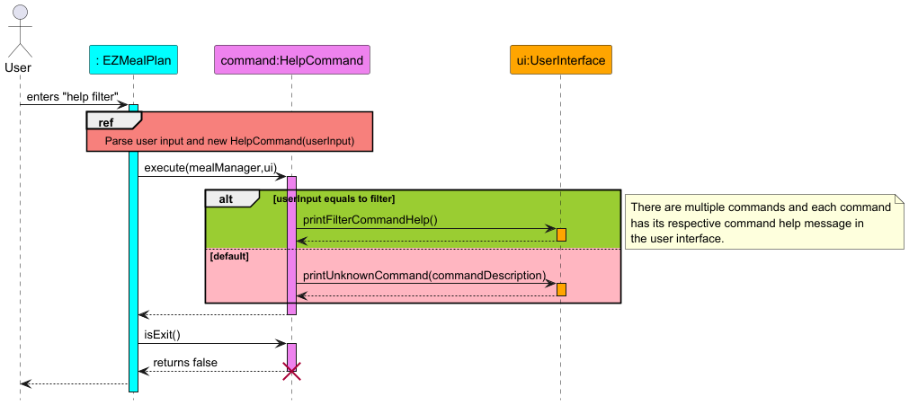

For simplicity purpose, only the command that matches the one in user input is shown in the sequence diagram. The full
`execute(mealManager,ui)` method actually consists of multiple options with each option representing a command keyword
and its respective help message to be printed by the user interface.

##### 11.4 Unit Testing

###### Testing Approach

- Uses a test-specific HelpCommandTest to ensure that the HelpCommand account for different types of user inputs and
  proceed as normal.
- Test with different types of user inputs.
- Executes HelpCommand.

###### Unit Test Code

Here is a snippet of the unit test code:

```java
// helpCommand_recipesInput_printsRecipesHelp
@Test
public void helpCommand_recipesInput_printsRecipesHelp() {
    logger.fine("running helpCommand_recipesInput_printsRecipesHelp");
    HelpCommand command = new HelpCommand("help recipes");
    command.execute(mealManager, ui);
    assertEquals("Recipes Help", outContent.toString());
    logger.fine("helpCommand_recipesInput_printsRecipesHelp() passed");
}

// helpCommand_wishlistInput_printsWishlistHelp
@Test
public void helpCommand_wishlistInput_printsWishlistHelp() {
    logger.fine("running helpCommand_wishlistInput_printsWishlistHelp");
    HelpCommand command = new HelpCommand("help wishlist");
    command.execute(mealManager, ui);
    assertEquals("Wishlist Help", outContent.toString());
    logger.fine("helpCommand_wishlistInput_printsWishlistHelp() passed");
}
```

### 12. BuyCommand and BuyChecker

##### 12.1 Design Overview

###### Function

BuyChecker checks for the validity of the user input before passing to the BuyCommand to add to-buy ingredient(s) as
stated in the user input.

###### Design Goals

**Single Responsibility:**

- BuyChecker solely handles the checks of the user input while BuyCommand solely handles the processing of the user
  input into ingredients and adding them into the inventory list.

**Decoupling:**

- By segregating responsibilities, it makes the code easier to maintain and extend.

**Testability:**

- The design supports unit testing by allowing test-specific BuyCommandTest and BuyCheckerTest to capture and verify the
  output.

##### 12.2 Implementation Details

###### Component Level: BuyChecker Class

- Inherits from the abstract Checker Class.
- Implements the `check()` method.
- Uses logging to indicate execution.
- `isPassed` is set to `true` once the user input passes all the required checks.
- Passes the valid user input back into the BuyCommand class for processing into ingredients and adding them into the
  inventory list.

###### Component Level: BuyCommand Class

- Inherits from the abstract Command class.
- Implements the `execute(MealManager mealManager, UserInterface ui)` method.
- Uses logging to indicate execution.
- Creates ingredients and add them into the inventory list.

###### Code Example

```java

@Override
public void check() throws EZMealPlanException {
    logger.fine("Checking '" + userInput + "' for buy command errors.");
    checkIngExists();
    checkIngredientExists();
    checkIngredientFormat();
    setPassed(true);
}
```

```java

@Override
public void execute(MealManager mealManager, UserInterface ui) throws EZMealPlanException {
    if (!checkValidUserInput()) {
        logger.severe("Invalid buy command input detected.");
        return;
    }

    parseIngredientsForBuy();

    Inventory inventory = mealManager.getInventory();
    for (Ingredient ingredient : ingredients) {
        // Add the ingredient (with name and price) into the inventory list.
        inventory.addIngredient(ingredient);
        ui.printBought(ingredient);
    }
    ingredients.clear();
}
```

##### 12.3 Sequence Diagram

Here is the sequence diagram for illustrating the interactions between BuyCommand, BuyChecker and other system component
classes while processing the user input:
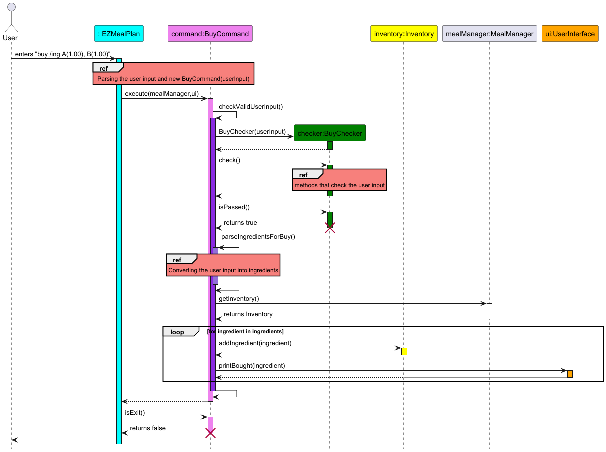
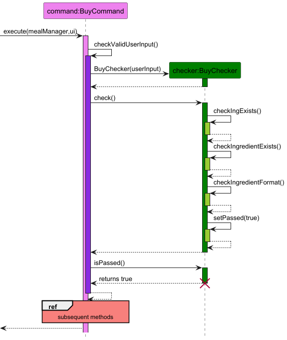

##### 12.4 Unit Testing

###### Testing Approach

- Uses a test-specific BuyCheckerTest and BuyCommandTest to ensure that the BuyChecker and BuyCommand account for
  different types of user inputs and proceed as normal.
- Test with different types of user inputs that gives no error and some exceptions.
- Executes BuyChecker and BuyCommand.
- Verifies that the exceptions are thrown according to the user inputs.

###### Unit Test Code

Here are some snippets of the unit test code:

```java

@Test
public void testExecute_validInputs_success() throws EZMealPlanException {
    logger.fine("Running testExecute_validInputs_success()");
    MealManager mealManager = new MealManager();
    String userInput = "buy /ing Apple (1.00), Banana(3.00)";
    Command command = new BuyCommand(userInput);
    command.execute(mealManager, ui);

    Inventory inventory = mealManager.getInventory();
    String expectedOutput = """
                1. Apple ($1.00): 1
                2. Banana ($3.00): 1
            """;
    assertEquals(expectedOutput, inventory.toString());
    logger.info("Correct ingredients added");
}

@Test
public void testExecute_repeatedIngredientsSamePrice_success() throws EZMealPlanException {
    logger.fine("Running testExecute_repeatedIngredientsSamePrice_success()");
    MealManager mealManager = new MealManager();
    String userInput = "buy /ing Apple (1.00), Banana (3.00), Apple (1.00)";
    Command command = new BuyCommand(userInput);
    command.execute(mealManager, ui);

    Inventory inventory = mealManager.getInventory();
    String expectedOutput = """
                1. Apple ($1.00): 2
                2. Banana ($3.00): 1
            """;
    assertEquals(expectedOutput, inventory.toString());
    logger.info("Correct ingredients added");
}
```

```java

@Test
public void buyChecker_singleIngredientInput_success() throws EZMealPlanException {
    logger.fine("Running buyChecker_singleIngredientInput_success()");
    BuyChecker checker = new BuyChecker("buy /ing Egg (1.00)");
    checker.check();
    logger.info("buyChecker_singleIngredientInput_success passed");
}

@Test
public void buyChecker_multipleIngredientInput_success() throws EZMealPlanException {
    logger.fine("Running buyChecker_multipleIngredientInput_success()");
    BuyChecker checker = new BuyChecker("buy /ing Egg (1.00), Milk (2.50)");
    checker.check();
    logger.info("buyChecker_multipleIngredientInput_success passed");
}

@Test
public void buyChecker_missingIngKeyword_throwsMissingIngKeywordException() {
    logger.fine("Running buyChecker_missingIngKeyword_throwsMissingIngKeywordException()");
    BuyChecker checker = new BuyChecker("buy Egg (1.00)");
    assertThrows(MissingIngKeywordException.class, checker::check);
    logger.info("buyChecker_missingIngKeyword_throwsMissingIngKeywordException passed");
}
```

### 13. ConsumeCommand and ConsumeChecker

##### 13.1 Design Overview

###### Function

- ConsumeChecker validates the correctness of the user input before it is processed by ConsumeCommand, which then
  removes (or consumes) the specified ingredient(s) from the inventory.

###### Design Goals

**Single Responsibility**

- ConsumeChecker focuses solely on validating user input (formatting, missing keywords, etc.).
- ConsumeCommand handles the logic of processing valid input and updating the inventory accordingly.
  **Decoupling**
- Separating validation (ConsumeChecker) from logic (ConsumeCommand) keeps the code clean and maintainable.
  **Testability**
- This design allows for targeted unit tests on both ConsumeChecker (for validation) and ConsumeCommand (for inventory
  consumption logic).

##### 13.2 Implementation Details

###### Component Level: ConsumeChecker Class

- Extends the abstract Checker class.
- Implements the check() method to verify if the user’s consume input is valid.
- Uses logging to record execution steps and validation outcomes.
- Once all checks pass, sets isPassed to true.
- If any validation fails (e.g., missing parameters, incorrect format), throws the relevant exception.
  A simplified overview of checks might include:
- /ing Keyword Check – Ensures that /ing is present to indicate ingredients.
- Ingredient Format Check – Checks each ingredient’s format (e.g., ingredient name (quantity)).
- Missing Ingredient Check – Ensures at least one ingredient is specified.

###### Component Level: ConsumeCommand Class

- Extends the abstract Command class.
- Implements the execute(MealManager mealManager, UserInterface ui) method.
- Uses logging to record the command’s execution.
- Parses the user input into ingredient objects, locates them in the Inventory, and decreases their quantities by the
  specified amount.
- If the ingredient’s quantity drops to zero or below, it can be removed from the inventory (depending on your design
  choice).

###### Code Example

```java

@Override
public void check() throws EZMealPlanException {
    logger.fine("Checking '" + userInput + "' for consume command errors.");
    checkIngKeyword();            // e.g., verify "/ing" is present
    checkIngredientFormat();      // e.g., verify "Egg (2)"
    checkQuantityValid();         // e.g., parse quantity to ensure it's a valid number
    setPassed(true);
    logger.info("ConsumeChecker: user input validated successfully.");
}
```

```java

@Override
public void execute(MealManager mealManager, UserInterface ui) throws EZMealPlanException {
    if (!checkValidUserInput()) {
        logger.severe("Invalid consume command input detected.");
        return;
    }

    // Parse the user input for ingredients to consume
    parseIngredientsForConsume();

    Inventory inventory = mealManager.getInventory();
    for (Ingredient ingredient : ingredientsToConsume) {
        inventory.consumeIngredient(ingredient);
        ui.printConsumed(ingredient);
        logger.fine("Consumed " + ingredient.getName() + ": " + ingredient.getQuantity());
    }
    ingredientsToConsume.clear();
}

```

##### 13.3 Sequence Diagram

Here is the sequence diagram for illustrating the interactions between ConsumeCommand, ConsumeChecker and other system
component classes while processing the user input:
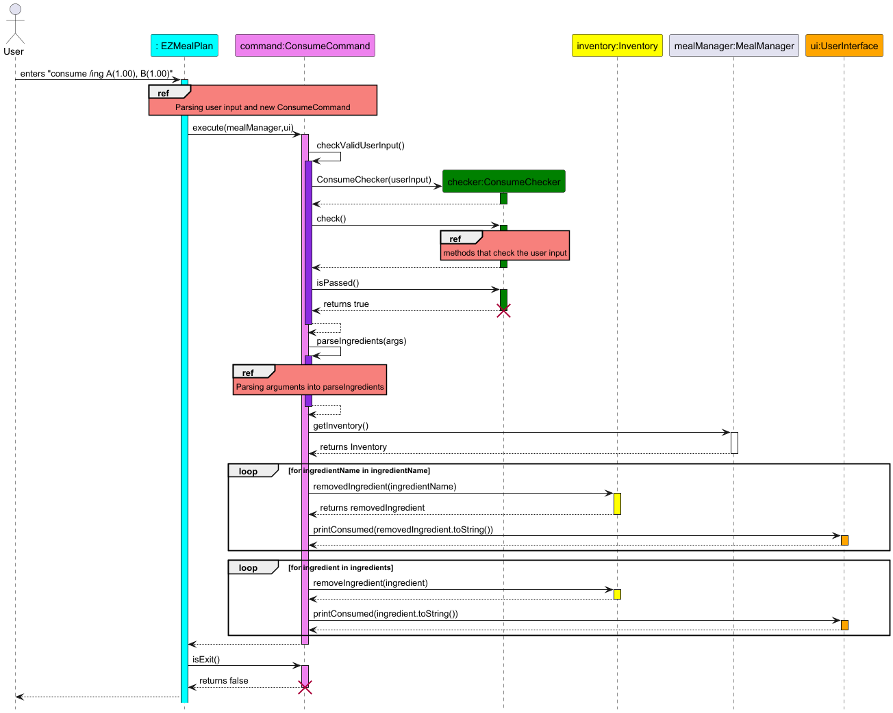
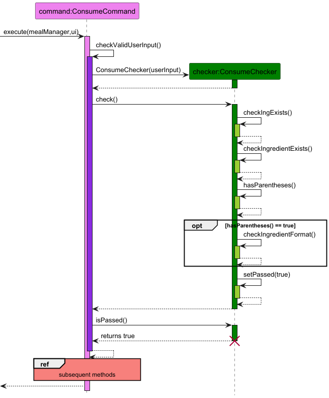

##### 13.4 Unit Testing

###### Testing Approach

- ConsumeCheckerTest and ConsumeCommandTest verify the correctness of user input validation and actual consumption
  logic, respectively.
- Test with correct inputs (e.g., consume /ing Egg (2)) and erroneous inputs (missing /ing, malformed quantity, etc.).
- Validate that the right exceptions are thrown for invalid inputs.

###### Unit Test Code

```java 

@Test
public void testExecute_validInput_success() throws EZMealPlanException {
    logger.fine("Running testExecute_validInput_success()");
    MealManager mealManager = new MealManager();
    Inventory inventory = mealManager.getInventory();
    inventory.addIngredient(ingredient1);
    inventory.addIngredient(ingredient3);
    inventory.addIngredient(ingredient4);
    String userInput = "consume /ing apple";
    Command command = new ConsumeCommand(userInput);
    command.execute(mealManager, ui);

    String expectedOutput = "    1. Banana ($3.00): 1" + ls + "    2. Chocolate ($4.00): 1" + ls;
    assertEquals(expectedOutput, inventory.toString());
    logger.info("Correct ingredient consumed");
}

@Test
public void testExecute_ingredientNotFound_exceptionThrown() {
    logger.fine("testExecute_ingredientNotFound_exceptionThrown()");
    MealManager mealManager = new MealManager();
    Inventory inventory = mealManager.getInventory();
    inventory.addIngredient(ingredient1);
    inventory.addIngredient(ingredient3);
    inventory.addIngredient(ingredient4);
    String userInput = "consume /ing duck";
    Command command = new ConsumeCommand(userInput);

    assertThrows(InventoryIngredientNotFound.class, () -> command.execute(mealManager, ui));
    logger.info("Correct exception thrown");
}
```

```java

@Test
public void consumeChecker_validInput_success() throws EZMealPlanException {
    logger.fine("Running consumeChecker_validInput_success()");
    ConsumeChecker checker = new ConsumeChecker("consume /ing Bread, Milk");
    checker.check();
    logger.info("consumeChecker_validInput_success passed");
}

@Test
public void consumeChecker_missingIngKeyword_throwsMissingIngKeywordException() {
    logger.fine("Running consumeChecker_missingIngKeyword_throwsMissingIngKeywordException()");
    ConsumeChecker checker = new ConsumeChecker("consume Milk, Bread");
    assertThrows(MissingIngKeywordException.class, checker::check);
    logger.info("consumeChecker_missingIngKeyword_throwsMissingIngKeywordException passed");
}

@Test
public void consumeChecker_noIngredients_throwsMissingIngredientException() {
    logger.fine("Running consumeChecker_noIngredients_throwsMissingIngredientException()");
    ConsumeChecker checker = new ConsumeChecker("consume /ing");
    assertThrows(MissingIngredientException.class, checker::check);
    logger.info("consumeChecker_noIngredients_throwsMissingIngredientException passed");
}
```

### 14. RecommendCommand and RecommendChecker

##### 14.1 Design Overview

###### Function
RecommendChecker checks for the validity of the user input before passing to the RecommendCommand to generate a list of recommended meals containing the ingredient as stated in the user input and selecting a random meal from it.

###### Design Goals

**Single Responsibility:**
- RecommendChecker solely handles the checks of the user input while RecommendCommand solely handles the processing of the user input into ingredient and randomly selecting a meal from the generated list of meals which contains the ingredient as suggested by the user.

**Decoupling:**
- By segregating responsibilities, it makes the code easier to maintain and extend.

**Testability:**
- The design supports unit testing by allowing test-specific RecommendCommandTest and RecommendCheckerTest to capture and verify the output.

##### 14.2 Implementation Details

###### Component Level: RecommendChecker Class
- Inherits from the abstract Checker Class.
- Implements the `check()` method.
- Uses logging to indicate execution.
- `isPassed` is set to `true` once the user input passes all the required checks.
- Passes the valid user input back into the RecommendCommand class for processing.

###### Component Level: RecommendCommand Class
- Inherits from the abstract Command class.
- Implements the `execute(MealManager mealManager, UserInterface ui)` method.
- Uses logging to indicate execution.
- Generates a list of recommended meals with the selected ingredient and randomly selects a meal to print.

###### Code Example
```java
 @Override
    public void execute(MealManager mealManager, UserInterface ui) throws EZMealPlanException {
        // Validate input using RecommendChecker.
        RecommendChecker checker = new RecommendChecker(validUserInput);
        checker.check();
        if (!checker.isPassed()) {
            logger.severe("Invalid recommend command input detected.");
            return;
        }

        // Extract the ingredient keyword.
        // Expected input format: "recommend /ing Chicken"
        int afterRecommendIndex = validUserInput.toLowerCase().indexOf(RECOMMEND) + RECOMMEND.length();
        String args = validUserInput.substring(afterRecommendIndex).trim();
        int ingIndex = args.toLowerCase().indexOf(ING);
        int invalidIndex = -1;
        if (ingIndex == invalidIndex) {
            logger.severe("Ingredient marker '/ing' not found in input.");
            ui.printMessage("Missing ingredient marker '/ing'.");
            return;
        }
        int afterIngIndex = ingIndex + ING.length();
        String extractedKeyword = args.substring(afterIngIndex).trim();
        if (extractedKeyword.isEmpty()) {
            logger.severe("No ingredient specified after '/ing'.");
            ui.printMessage("No ingredient specified.");
            return;
        }

        // Proceed with recommendation logic.
        Inventory inventory = mealManager.getInventory();

        // First, filter the user meal list (wishlist) by the ingredient keyword.
        List<Meal> wishList = mealManager.getWishList().getList();
        List<Meal> candidateMeals = filterMealsByIngredient(wishList, extractedKeyword);

        // If no matching meals in the wishlist, try the recipes list.
        if (candidateMeals.isEmpty()) {
            List<Meal> recipesList = mealManager.getRecipesList().getList();
            candidateMeals = filterMealsByIngredient(recipesList, extractedKeyword);
        }

        if (candidateMeals.isEmpty()) {
            ui.printMessage("No meal found containing ingredient: " + extractedKeyword);
            return;
        }

        // Randomly select a meal from the candidate meals.
        Random random = new Random();
        Meal selectedMeal = candidateMeals.get(random.nextInt(candidateMeals.size()));

        // Build the output message.
        StringBuilder sb = new StringBuilder();
        sb.append("Recommended Meal: ").append(selectedMeal.getName())
                .append(" (").append(selectedMeal).append(")")
                .append(System.lineSeparator());
        sb.append("Ingredients:").append(System.lineSeparator());

        List<Ingredient> mealIngredients = selectedMeal.getIngredientList();
        for (int i = 0; i < mealIngredients.size(); i++) {
            Ingredient ing = mealIngredients.get(i);
            sb.append("   ").append(i + 1).append(". ").append(ing.toString())
                    .append(System.lineSeparator());
        }

        // Determine which ingredients are missing from the inventory.
        List<String> missingIngredients = mealIngredients.stream()
                .filter(ing -> !inventory.hasIngredient(ing.getName().toLowerCase()))
                .map(Ingredient::getName)
                .collect(Collectors.toList());
        if (missingIngredients.isEmpty()) {
            sb.append("You have all the necessary ingredients for this meal.");
        } else {
            sb.append("Missing Ingredients: ").append(String.join(", ", missingIngredients));
        }

        ui.printMessage(sb.toString());
    }
```
```java
 @Override
    public void check() throws EZMealPlanException {
        logger.fine("Checking '" + userInput + "' for recommend command errors.");
        checkIngExists();
        checkIngredientExists();
        setPassed(true);
    }
```

##### 14.3 Sequence Diagram

Here is the sequence diagram for illustrating the interactions between RecommendCommand, RecommendChecker and other system component classes while processing the user input:

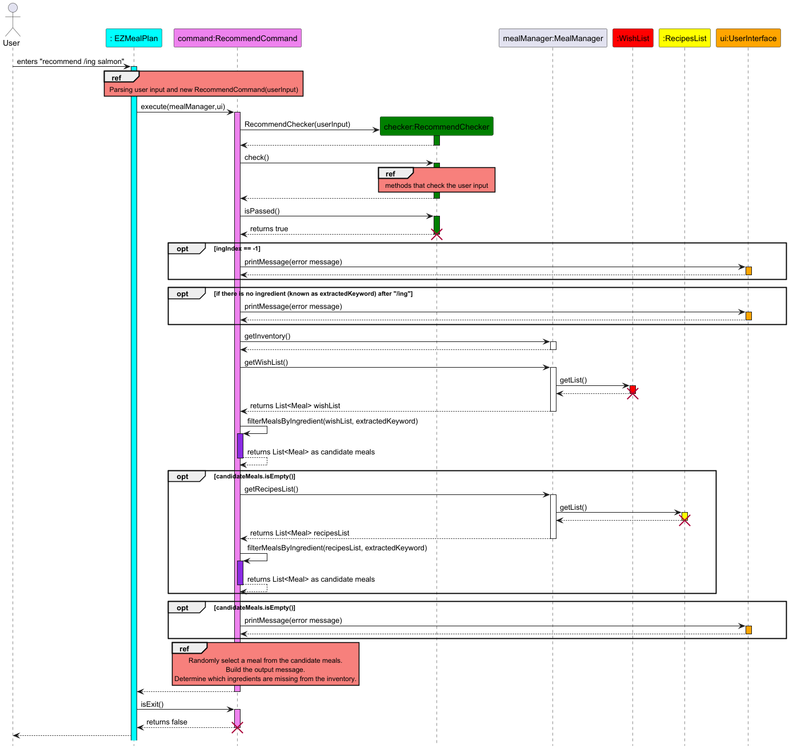
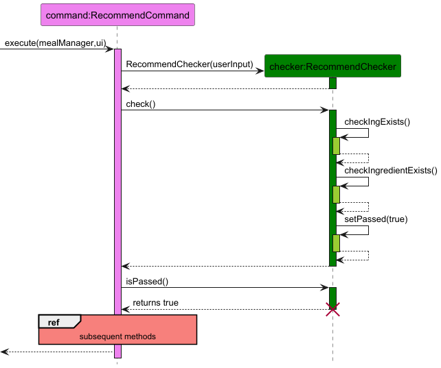

##### 14.4 Unit Testing

###### Testing Approach
- Uses a test-specific RecommendCommandTest to ensure that the RecommendChecker and RecommendCommand account for different types of user inputs and proceed as normal.
- Test with different types of user inputs that gives no error and some exceptions.
- Executes RecommendChecker and RecommendCommand.
- Verifies that the exceptions are thrown according to the user inputs.

###### Unit Test Code
Here is a snippet of the unit test code:
```java
@Test
public void recommendCommand_matchingIngredientInWishlist_success() throws Exception {
    logger.fine("Running recommendCommand_matchingIngredientInWishlist_success()");
    MealManager mealManager = new MealManager();
    mealManager.getWishList().getList().clear();
    mealManager.getRecipesList().getList().clear();

    Meal meal = new Meal("Salmon Rice");
    meal.addIngredient(new Ingredient("salmon", "2.50"));
    mealManager.getWishList().addMeal(meal);

    TestUI ui = new TestUI();
    RecommendCommand command = new RecommendCommand("recommend /ing salmon");
    command.execute(mealManager, ui);

    StringBuilder sb = new StringBuilder();
    sb.append("Recommended Meal: ").append("Salmon Rice")
            .append(" (").append("Salmon Rice ($2.50)").append(")")
            .append(System.lineSeparator());
    sb.append("Ingredients:").append(System.lineSeparator());
    sb.append("   ").append(1).append(". ").append("salmon ($2.50)")
            .append(System.lineSeparator());
    sb.append("Missing Ingredients: salmon");
    assertEquals(sb.toString(), ui.capturedMessage);
    logger.info("recommendCommand_matchingIngredientInWishlist_success passed");
}

@Test
public void recommendCommand_matchingIngredientInRecipes_success() throws Exception {
    logger.fine("Running recommendCommand_matchingIngredientInRecipes_success()");
    MealManager mealManager = new MealManager();
    mealManager.getWishList().getList().clear();
    mealManager.getRecipesList().getList().clear();

    Meal meal = new Meal("Tofu Soup");
    meal.addIngredient(new Ingredient("tofu", "1.20"));
    mealManager.getRecipesList().getList().add(meal);

    TestUI ui = new TestUI();
    RecommendCommand command = new RecommendCommand("recommend /ing tofu");
    command.execute(mealManager, ui);

    StringBuilder sb = new StringBuilder();
    sb.append("Recommended Meal: ").append("Tofu Soup")
            .append(" (").append("Tofu Soup ($1.20)").append(")")
            .append(System.lineSeparator());
    sb.append("Ingredients:").append(System.lineSeparator());
    sb.append("   ").append(1).append(". ").append("tofu ($1.20)")
            .append(System.lineSeparator());
    sb.append("Missing Ingredients: tofu");
    assertEquals(sb.toString(), ui.capturedMessage);
    logger.info("recommendCommand_matchingIngredientInRecipes_success passed");
}
```

### 15. InventoryCommand

##### 15.1 Design Overview

###### Function
InventoryCommand is responsible for fetching the inventory list from the MealManager and displaying them via the
UserInterface.

###### Design Goals

**Single Responsibility:**

- InventoryCommand only deals with retrieving the inventory list and forwarding it to the UI.

**Decoupling:**

- By isolating the command logic from both the UI and data management, future changes in either will have minimal
  impact.

**Testability:**

- The design allows for easy unit testing by injecting a test-specific InventoryTest to capture and verify the output.

##### 15.2 Implementation Details

###### Component Level: InventoryCommand Class
- Inherits from the abstract Command class.
- Implements the `execute(MealManager mealManager, UserInterface ui)` method.
- Uses logging to indicate execution.
- Retrieve the list of unique ingredients and their respective counts from the inventory list.

###### Code Example
```java
@Override
    public void execute(MealManager mealManager, UserInterface ui) throws EZMealPlanException {
        assert mealManager != null : "MealManager cannot be null";
        logger.fine("Executing 'inventory' command");
        Inventory inventory = mealManager.getInventory();
        ui.printInventory(inventory.toString());
    }
```
##### 15.3 Sequence Diagram
Here is the sequence diagram for illustrating the interactions between InventoryCommand and other system component classes:
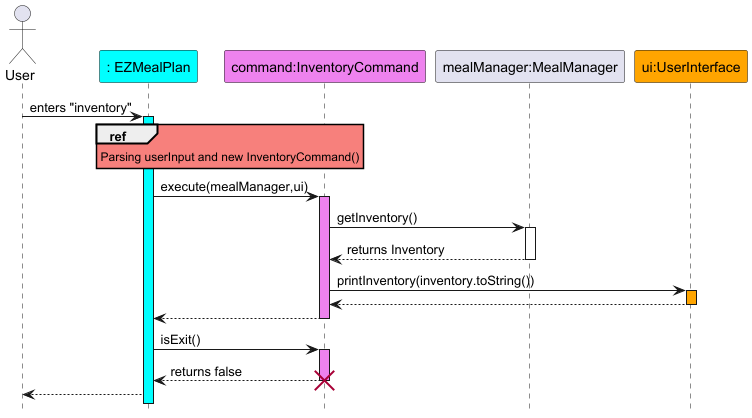

##### 15.4 Unit Testing

###### Testing Approach
- Uses a test-specific InventoryCommandTest to ensure that the InventoryCommand account for different types of user inputs and proceed as normal.
- Test with different types of user inputs that gives no error and some exceptions.
- Executes InventoryCommand.
- Verifies that the exceptions are thrown according to the user inputs.

###### Unit Test Code
Here is a snippet of the unit test code:
```java
@Test
    void addIngredient_differentIngredients_success() {
        Inventory inventory = new Inventory();
        inventory.addIngredient(ingredient1);
        inventory.addIngredient(ingredient3);
        inventory.addIngredient(ingredient4);
        String expectedOutput = "    1. Apple ($1.00): 1" + ls + "    2. Banana ($3.00): 1" + ls +
                "    3. Chocolate ($4.00): 1" + ls;
        assertEquals(expectedOutput, inventory.toString());
    }

    @Test
    void addIngredient_repeatedIngredientsSamePrice_repetitionCaptured() {
        Inventory inventory = new Inventory();
        inventory.addIngredient(ingredient1);
        inventory.addIngredient(ingredient5);
        inventory.addIngredient(ingredient3);
        inventory.addIngredient(ingredient4);
        String expectedOutput = "    1. Apple ($1.00): 2" + ls + "    2. Banana ($3.00): 1" + ls +
                "    3. Chocolate ($4.00): 1" + ls;
        assertEquals(expectedOutput, inventory.toString());
    }
```

## Implementation

## Appendices

### Appendix A: Product scope

#### Target user profile

- **Health-conscious** users who **track food intake** and **prefer meal transparency**.

- **Budget-conscious** users who want to **manage cost-per-meal**.

- **Lazy or busy** users looking for **quick, filtered suggestions**.

- **Home cooks** who want to **create** and **store their own recipes**.

- Users who want a **lightweight, offline meal planning CLI** app.

#### Value proposition

EZMealPlan provides a **simple, command-line interface** for **selecting and managing meals**, **filtering by cost or
ingredients**, and **building personalized meal plans**. It solves the problem of:

- **Searching manually** for affordable, relevant recipes
- **Remembering** preferred meals or dietary patterns
  3- **Planning meals** within budget constraints

### Appendix B: User Stories

| Version | As a ...                           | I want to ...                                        | So that I can ...                                                   |
|---------|------------------------------------|------------------------------------------------------|---------------------------------------------------------------------|
| v1.0    | Lazy user                          | Filter for existing recipes by ingredients           | See what is the easiest item I can prepare                          |
| v1.0    | Broke user                         | Filter for existing recipes by cost                  | See what is the recipes that i can afford                           |
| v1.0    | User looking for a specific recipe | Filter for existing recipes by name                  | See if they have my favourite recipes                               |
| v1.0    | Creative user that cooks           | Add and save personal recipes                        | Choose them at my own discretion in the future                      | 
| v1.0    | User that cooks                    | Delete personal recipes                              | Remove unwanted recipes                                             | 
| v1.0    | User that is on a budget           | Check the prices of each ingredient                  | Know how much each ingredient costs                                 | 
| v1.0    | User that wants to explore         | View all the recipes                                 | See what I like                                                     |
| v1.0    | User                               | Select from the list of recipes and add it to my own | better access my favourite recipes                                  |
| v1.0    | User                               | View and delete my personal list of recipes          | keep my list of favourite recipes updated                           |
| v1.0    | User change their mind easily      | Clear my personal recipes in one command             | start to keep the recipes from scratch again                        |
| v1.0    | User that appreciates convince     | Exit and save my my edits from the edits I made      | not update all the thing from scratch every time i use this program |

| Version | As a ...        | I want to ...                                                                 | So that I can ...                                    |
|---------|-----------------|-------------------------------------------------------------------------------|------------------------------------------------------|
| v2.0    | Organized user  | View my ingredient inventory                                                  | Know what ingredients I currently have available     |
| v2.0    | User            | Add bought ingredients to my inventory                                        | Keep track of ingredients I purchased                |
| v2.0    | User            | Remove consumed ingredients from my inventory                                 | Keep my ingredient inventory accurate and up to date |
| v2.0    | Indecisive user | Get recipe recommendations from my wishlist                                   | Decide what to cook next                             |
| v2.0    | Indecisive user | Get recipe recommendations from the user list if the wish list do not have it | Expand my choices                                    |
| v2.0    | Indecisive user | Get recipe recommendations by the ingredients                                 | let the program decided for me on what to eat        |
| v2.0    | Indecisive user | know what ingredients that i am missing for the recommended recipes           | know what to buy based on the missing ingredients    |

### Appendix C: Non-Functional Requirements

- Runs on any **Java 17-compatible environment**.

- Uses only **standard Java libraries** (no external dependencies).

- Supports **fast startup** (<1 second).

### Appendix D: Glossary

- **Meal** – A recipe with a name, total cost, and associated ingredients.

- **Ingredient** – A component of a meal with a name and cost.

- **Recipes List** – All available meals in the system.

- **Wishlist** – Meals selected by the user for their meal plan.

- **Command** – A user instruction (e.g., `filter`, `view`, `exit`).

- **Filter** – A command to narrow down meals by name, cost, or ingredient.

- **View** – Shows ingredients and costs of a selected meal.

### Appendix E: Instructions for manual testing

### Setup

1. Ensure you have Java 17 installed.

2. Run using:

```
java -jar ezmealplan.jar
```

### Testing Scenarios

- **`Load data`**: Ensure recipesList.txt and wishList.txt are present.

- **`recipes`**: Shows all meals alphabetically sorted.

- **`wishlist`**: Displays meals user has selected.

- **`filter /mcost 5.00`**: Shows meals costing exactly $5.00.

- **`filter /ing chicken, rice`**: Filters meals containing all specified ingredients.

- **`select 2 /mname chicken`**: Selects the second filtered result.

- **`create /mname burger /ing bun (1.00), patty (2.00)`**: Adds new meal.

- **`view /r 1`**: Displays first meal from the recipes list.

- **`remove 1`**: Removes first meal from the wishlist.

- **`delete 2`**: Deletes from both lists (if applicable).

- **`clear`**: Empties the wishlist.

- **`exit`**: Saves both lists and exits.