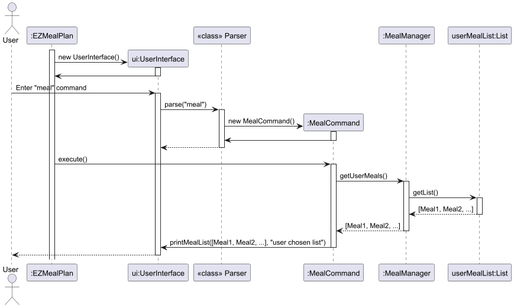
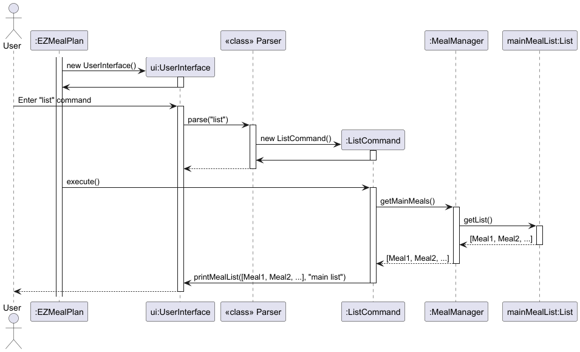

# Developer Guide

## Acknowledgements

{list here sources of all reused/adapted ideas, code, documentation, and third-party libraries -- include links to the original source as well}

## Design

EZMealPlan follows a modular and object-oriented design centered around a command-based architecture.

### Architecture Overview

- **Parser**: Interprets user input and delegates to appropriate command classes.
- **Command classes**: Each command is encapsulated in its own class (e.g., `ListCommand`, `FilterCommand`, `SelectCommand`) that implements an `execute()` method.
- **MealList and UserMealList**: Encapsulate meal storage and operations, such as adding, removing, and viewing meals.
- **Meal and Ingredient**: Core data classes representing recipes and their components.
- **Storage**: Handles saving and loading from `main_meal_list.txt` and `user_meal_list.txt`.

### Logging

- Global logger is initialized in the `EZMealPlan` class.

- Functional classes use `logger.WARNING` for exceptions and `logger.SEVERE` for assertions.

- JUnit test classes use their own logger with `logger.INFO` for exceptions.

## Input Handling

- All user inputs are case-sensitive and normalised to lowercase.

This sequence diagram shows the processes that EZMealPlan system has to undergo while it is being booted up before it is ready for usage.


This sequence diagram shows the general flow of how the EZMealPlan system process the respective command inputted by the user. Many relevant details and classes have been omitted for the purpose of simplicity. The implementations for the respective commands will be explained in greater details and illustrated with UML diagrams later.

### Food Package

The food package contains the abstract class `Product`, as well as `Ingredient` and `Meal` classes.


The `Ingredient` class,
* Represents an ingredient, which has a `name` and `price`
* Contains the `setPrice` method, as well as private methods to check that 
the price provided is non-negative and able to be parsed as a `Double`

The `Meal` class,
* Represents a meal, which has a `name`, `price`, and `ingredientList` of type `List<Ingredient>`.
* Contains the `addIngredient` method that adds an `Ingredient` into its `ingredientList`. While doing so, it
also retrieves and adds the `price` of the `Ingredient` into the meal's `price`.
* Contains a private method that checks if an `Ingredient` to be added is already duplicated in the `ingredienList`, and
throws an exception.

### Enhancements in the Command Module

Both commands extend the abstract Command class, thereby following our command design pattern to decouple user input parsing from the actual execution of features. 
The primary objective of these commands is to ensure a clear separation of concerns, improve maintainability, and allow for easier testing.

#### 1. MealCommand

##### 1.1 Design Overview

###### Function
MealCommand is responsible for fetching the user meals from the MealManager and displaying them via the UserInterface.

###### Design Goals

**Single Responsibility:**
- MealCommand only deals with retrieving the user-selected meal list and forwarding it to the UI.

**Decoupling:**
- By isolating the command logic from both the UI and data management, future changes in either will have minimal impact.

**Testability:**
- The design allows for easy unit testing by injecting a test-specific UI that captures the output.

##### 1.2 Implementation Details

###### Component Level: MealCommand Class

- Inherits from the abstract Command class
- Implements the `execute(MealManager mealManager, UserInterface ui)` method
- Uses logging (via `logger.fine`) to trace execution
- Retrieves the user meal list using `mealManager.getUserMeals().getList()`
- Passes the list to the UI's `printMealList` method with the label "user chosen meals"

###### Code Example
```java
@Override
public void execute(MealManager mealManager, UserInterface ui) throws EZMealPlanException {
    logger.fine("Executing MealCommand");
    List<Meal> userMealList = mealManager.getUserMeals().getList();
    ui.printMealList(userMealList, "user chosen meals");
}
```

##### 1.3 Sequence Diagram



##### 1.4 Unit Testing

###### Testing Approach
- A test-specific subclass of UserInterface (named TestUserInterface) is defined to capture the parameters passed to the `printMealList` method
- The unit test populates the MealManager's user meals list with sample meals
- Executes MealCommand
- Asserts that the UI received the expected label and list of meals

###### Unit Test Code
```java
@Test
public void testExecute_mealCommand_printsUserChosenMeals() throws EZMealPlanException {

    MealManager mealManager = new MealManager();
    Meal meal1 = new Meal("Meal A");
    Meal meal2 = new Meal("Meal B");
    mealManager.getUserMeals().getList().add(meal1);
    mealManager.getUserMeals().getList().add(meal2);

    TestUserInterface testUI = new TestUserInterface();
    MealCommand wishlistCommand = new MealCommand();
    wishlistCommand.execute(mealManager, testUI);

    assertEquals("user chosen meals", testUI.capturedListName);
    List<Meal> expectedMeals = new ArrayList<>();
    expectedMeals.add(meal1);
    expectedMeals.add(meal2);
    assertIterableEquals(expectedMeals, testUI.capturedMeals);
}
```

#### 2. ListCommand

##### 2.1 Design Overview

###### Function
ListCommand fetches the main meal list from the MealManager and instructs the UI to display it.

###### Design Goals

**Single Responsibility:**
- ListCommand solely handles the retrieval and display of the main meals.

**Decoupling:**
- By segregating responsibilities, it makes the code easier to maintain and extend.

**Testability:**
- The design supports unit testing by allowing a test-specific UI to capture and verify the output.

##### 2.2 Implementation Details

###### Component Level: ListCommand Class

- Inherits from the abstract Command class
- Implements the `execute(MealManager mealManager, UserInterface ui)` method
- Uses logging to indicate execution
- Retrieves the main meal list using `mealManager.getMainMeals().getList()`
- Calls `ui.printMealList` with the label "main list"

###### Code Example
```java
@Override
public void execute(MealManager mealManager, UserInterface ui) throws EZMealPlanException {
    logger.fine("Executing 'list' command");
    List<Meal> mainMealList = mealManager.getMainMeals().getList();
    ui.printMealList(mainMealList, "main list");
}
```

##### 2.3 Sequence Diagram



##### 2.4 Unit Testing

###### Testing Approach
- Uses a test-specific TestUserInterface subclass to capture the output of `printMealList`
- Sets up the main meal list in the MealManager
- Executes ListCommand
- Verifies that the UI output matches the expected label and meal list

###### Unit Test Code
```java
@Test
public void testExecute_listCommand_printsMainList() throws EZMealPlanException {

    MealManager mealManager = new MealManager();
    Meal meal1 = new Meal("Main Meal 1");
    Meal meal2 = new Meal("Main Meal 2");
    mealManager.getMainMeals().getList().add(meal1);
    mealManager.getMainMeals().getList().add(meal2);

    TestUserInterface testUI = new TestUserInterface();
    ListCommand recipesCommand = new ListCommand();
    recipesCommand.execute(mealManager, testUI);

    assertEquals("main list", testUI.capturedListName);
    List<Meal> expectedMeals = new ArrayList<>();
    expectedMeals.add(meal1);
    expectedMeals.add(meal2);
    assertIterableEquals(expectedMeals, testUI.capturedMeals);
}
```
## Implementation


## Appendices


### Appendix A: Product scope


#### Target user profile

- **Health-conscious** users who **track food intake** and **prefer meal transparency**.

- **Budget-conscious** users who want to **manage cost-per-meal**.

- **Lazy or busy** users looking for **quick, filtered suggestions**.

- **Home cooks** who want to **create** and **store their own recipes**.

- Users who want a **lightweight, offline meal planning CLI** app.

#### Value proposition

EZMealPlan provides a **simple, command-line interface** for **selecting and managing meals**, **filtering by cost or ingredients**, and **building personalized meal plans**. It solves the problem of:

- **Searching manually** for affordable, relevant recipes
- **Remembering** preferred meals or dietary patterns
3- **Planning meals** within budget constraints

### Appendix B: User Stories

| Version | As a ...                 | I want to ...                                                                                           | So that I can ...                                                             |
|---------|--------------------------|---------------------------------------------------------------------------------------------------------|-------------------------------------------------------------------------------|
| v1.0    | Health-conscious user    | Add my desired calorie intake per day                                                                   | Track my actual intake against that to see how close I am                     |
| v1.0    | Lazy user                | Search for existing recipes by ingredients                                                              | See what is the easiest item I can prepare                                    |
| v1.0    | User                     | Add recipes I come across online                                                                        | View all recipes available in one place                                       | 
| v1.0    | Health-conscious user    | View a graph or figure of my calorie intake over time                                                   | Track my progress towards my goal                                             |
| v1.0    | Indecisive user          | Get recommended recipes                                                                                 | Have a better idea of what to eat                                             | 
| v1.0    | User                     | Get recipe suggestions based on the ingredients available in the supermarket                            | Know which ingredients to purchase                                            |
| v1.0    | Organised user           | Get recipe suggestions that complement the ingredients I have                                           | Use up most of the ingredients I have have left before buying new ingredients |
| v1.0    | Picky-eater user         | Mark ingredients or recipes that I dislike                                                              | Avoid them                                                                    | 
| v1.0    | Picky-eater user         | Mark my favourite ingredients or recipes                                                                | Receive recommendations that match my preferences                             | 
| v1.0    | Careless user            | Backtrack and change my input preferences before confirmation for recipe recommendations                | Get the right recommended recipes                                             | 
| v1.0    | Creative user that cooks | Add and save personal recipes                                                                           | Choose them at my own discretion in the future                                | 
| v1.0    | User that cooks          | Delete personal recipes                                                                                 | Remove unwanted recipes                                                       | 
| v1.0    | Frugal user              | Get recipes that fulfil my budget                                                                       | Avoid overspending                                                            | 
| v1.0    | User that cooks          | Change some of the main ingredients to something that I like                                            | Eat what I like                                                               |
| v1.0    | User that cooks          | Show recipe instructions                                                                                | Follow as I cook                                                              |
| v1.0    | Organised user           | Organize all recipes by different categories (e.g., family recipes, favorite chef, favorite main, etc.) | Stay organized and find recipes easily                                        |
| v1.0    | User                     | Check the prices of each ingredient                                                                     | Know how much each ingredient costs                                           | 
| v1.0    | User                     | Check for any promotions on ingredients relevant to the recipe                                          | Save more money                                                               | 
| v1.0    | Time-constrained user    | Check for recipes based on cook time                                                                    | Quickly find recipes for myself                                               |
| v1.0    | Social user              | Share my favorite recipes with friends                                                                  | Get feedback from friends or cooks                                            |
| v1.0    | new user                 | see usage instructions                                                                                  | refer to them when I forget how to use the application                        |

|v2.0|user|find a to-do item by name|locate a to-do without having to go through the entire list|

### Appendix C: Non-Functional Requirements

- Runs on any **Java 17-compatible environment**.

- Uses only **standard Java libraries** (no external dependencies).

- Supports **fast startup** (<1 second).

### Appendix D: Glossary

- **Meal** – A recipe with a name, total cost, and associated ingredients.

- **Ingredient** – A component of a meal with a name and cost.

- **Main List** – All available meals in the system.

- **User List** – Meals selected by the user for their meal plan.

- **Command** – A user instruction (e.g., `filter`, `view`, `exit`).

- **Filter** – A command to narrow down meals by name, cost, or ingredient.

- **View** – Shows ingredients and costs of a selected meal.

### Appendix E: Instructions for manual testing

### Setup

1. Ensure you have Java 17 installed.

2. Run using:
```
java -jar ezmealplan.jar
```
### Testing Scenarios

- **`Load data`**: Ensure main_meal_list.txt and user_meal_list.txt are present.

- **`list`**: Shows all meals alphabetically sorted.

- **`meal`**: Displays meals user has selected.

- **`filter /mcost 5.00`**: Shows meals costing exactly $5.00.

- **`filter /ing chicken, rice`**: Filters meals containing all specified ingredients.

- **`select 2 /mname chicken`**: Selects the second filtered result.

- **`create /mname burger /ing bun (1.00), patty (2.00)`**: Adds new meal.

- **`view /m 1`**: Displays first meal from main list.

- **`remove 1`**: Removes first meal from user list.

- **`delete 2`**: Deletes from both lists (if applicable).

- **`clear`**: Empties user meal list.

- **`exit`**: Saves user list and exits.